# SCAN 2024 CTF Quals Writeup

SCAN 2024 CTF は「The world's first digital asset tracing CTF」と謳う通り、暗号資産取引の追跡技術を競う大会でした。
私は [jinu](https://x.com/lj1nu) と [gss1](https://x.com/gosasu1) の3人でチーム「Tornado Cats」で予選に出て、全ての問題を解き2位でした。
11月22日に韓国で本戦があり、優勝賞金1 BTCらしい。

感想
- 暗号資産取引の追跡は、言うなれば「ブロックチェーンのOSINT」というカオスなカテゴリだったが、追跡オンリーの競技は過去見たことなく新鮮だった。
- 作問チームは DEFCON 常連の Theori もとい ChainLight のガチメンツだったので、guess を抑えめにするなどの工夫があり良かった。
- 通常のOSINTと異なり、基本的に全ての情報は台帳上にイミュータブルなものとして公開されているため、解法の再現性が高くホワイトボックス的なOSINTである点はいいなと思った（簡単な例だと「Google Lens の挙動が変わって解けなくなる」といったことがない）。
- インターポールの支援を受けていて、世界各国の警察組織のチームと競い合えたのが面白かった。first blood を狙っていた問題が、ブラジルの警察に先に解かれて悔しかった。

以下、全問題のwriteup（まだ本戦があるので、チームメンバーが取り組んだ問題も解いた）。大きく4つのシナリオに分かれており、大体それぞれ以下のようなトピックだった:
- ScanToken: クロスチェーン送金、資金洗浄、Uniswap V2
- Bridge: プロキシコントラクト、ECRECOVER、MEV
- Drainer: フィッシング、JavaScript難読化、Inferno Drainer
- CAT: Bitcoin、ScriptPubKey/ScriptSig

**問題一覧**
- [ScanToken - 1](#scantoken---1)
- [ScanToken - 2](#scantoken---2)
- [ScanToken - 3](#scantoken---3)
- [ScanToken - 4](#scantoken---4)
- [ScanToken - 5](#scantoken---5)
- [Bridge - 1](#bridge---1)
- [Bridge - 2](#bridge---2)
- [Bridge - 3](#bridge---3)
- [Bridge - 4](#bridge---4)
- [Bridge - 5](#bridge---5)
- [Bridge - 6](#bridge---6)
- [Drainer - 1](#drainer---1)
- [Drainer - 2](#drainer---2)
- [Drainer - 3](#drainer---3)
- [Drainer - 4](#drainer---4)
- [CAT - 1](#cat---1)
- [CAT - 2](#cat---2)
- [CAT - 3](#cat---3)

## ScanToken - 1

### Description

**Intro**

`ScanToken` minter held the amount of `ScanToken` designated for the airdrop in the Airdrop Fund Wallet. However, the private key of the Airdrop Fund Wallet has been compromised, and the attacker dumped `ScanToken` into the liquidity pool to swap for `ScanUSDC` (the minter provided the initial liquidity). Analyze the process by which the attacker dumped `ScanToken`.

(In this scenario, assume `ScanUSDC` is equivalent to 1 USD.)

**Task**

The address below is the `ScanToken` minter address. They transferred the airdrop tokens to the Airdrop Fund Wallet. Identify the Airdrop Fund Wallet address.

`ScanToken` Minter: [https://amoy.polygonscan.com/address/0xEc7a6b42CD4DC1a2750FE01d88f1f3396D7c1BfF](https://amoy.polygonscan.com/address/0xEc7a6b42CD4DC1a2750FE01d88f1f3396D7c1BfF)

**Flag Format (case-insensitive):** `SCAN2024{Airdrop Fund Wallet Address}`

ex) `SCAN2024{0xB49bf876BE26435b6fae1Ef42C3c82c5867Fa149}`

### Solution

まずシナリオを整理すると:
- `ScanToken`というトークンがある
- `ScanToken`発行者が`ScanToken`をエアドロップ用のウォレットに移した
- しかし攻撃者が、何らかの手段でエアドロップ用ウォレットのプライベートキーを取得した
- それにより、攻撃者は`ScanToken`を何らかのDEXを用いてトークンを売却した
- その流動性プールは`ScanToken`と`ScanUSDC`のペアであった

そして、最初の問題のゴールは、`ScanToken`のエアドロップ用ウォレットのアドレスを特定すること。

`ScanToken`の発行者のアドレスが与えられているので、とりあえず[そのアドレスのトークンの送受金履歴](https://amoy.polygonscan.com/address/0xEc7a6b42CD4DC1a2750FE01d88f1f3396D7c1BfF#tokentxns)を見る:

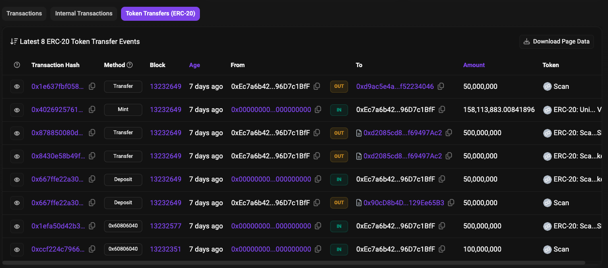

発行者から4回送金が行われている:
- `0x90cD8b4DeB62005c98b92045d4e2350129Ee65B3` に `ScanToken` が 50M
- `0xd2085cd8e31cB6f938498DB0fd1D48bf69497Ac2` に `ScanRebasingToken` が 50M
- `0xd2085cd8e31cB6f938498DB0fd1D48bf69497Ac2` に `ScanUSDC` が 50M
- `0xd9ac5e4a9df4378d40A8bdc15CfA9A8f52234046` に `ScanToken` が 50M

2番目と3番目の送金からアドレス `0xd2085cd8e31cB6f938498DB0fd1D48bf69497Ac2` が流動性プールなのは想像できるので、前後のアドレスのどちらかがエアドロップ用だとわかる。
あと謎のトークン `ScanRebasingToken` が登場する。

1番目と4番目の送金のそれぞれの宛先アドレスを調べると、アドレス `0x90cD8b4DeB62005c98b92045d4e2350129Ee65B3` は `ScanRebasingToken` のコントラクトで、 アドレス `0xd9ac5e4a9df4378d40A8bdc15CfA9A8f52234046` が単なるEOAだとわかるので、消去法で後者で確定。

Flag: `SCAN2024{0xd9ac5e4a9df4378d40A8bdc15CfA9A8f52234046}`

## ScanToken - 2

### Description

The attacker used the stolen private key of the Airdrop Fund Wallet to transfer `ScanToken` to one of the attacker's addresses in the form of another token.

Find the earliest transaction where the attacker's address received the other form of `ScanToken` mentioned above.

**Flag Format (case-insensitive):** `SCAN2024{TransactionHash}`

e.g. `SCAN2024{0x0000000000000000000000000000000000000000000000000000000000000001}`

### Solution

攻撃者が不正にエアドロップ用アドレスを操作し、`ScanToken` を `ScanRebasingToken` に変えて送金したそう。
そしてこの問題のゴールは、その送金を受け取った最初のトランザクションハッシュを特定すること。

とりあえず、[エアドロップ用アドレスの送受金履歴](https://amoy.polygonscan.com/address/0xd9ac5e4a9df4378d40a8bdc15cfa9a8f52234046#tokentxns)を見る:

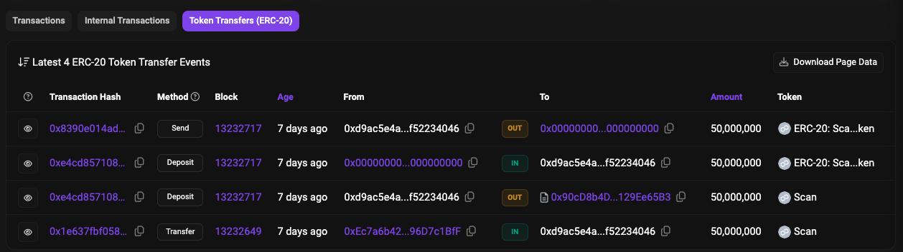

`ScanToken` を `ScanRebasingToken` に変えたあと、`Send` メソッド内でゼロアドレスに送金（バーン）している。

[そのバーンしたトランザクションのログ](https://amoy.polygonscan.com/tx/0x8390e014ad0178d6868c21b082bf44f75a9ea4ad233297fd6708711c33f47e6e#eventlog)を表層的に分析してみると、以下のイベントが実行されていることがわかる:
- `LogTransfer`
- `Transfer`
- `LogTransfer`
- `ExecutorFeePaid`
- `DVNFeePaid`
- `PacketSend`
- `LogTransfer`
- `OFTSent`
- `LogFeeTransfer`

`OFTSent` などの特徴的なイベントがあり、[LayerZero V2 OFT](https://docs.layerzero.network/v2/developers/evm/oft/quickstart) のクロスチェーンの送金が行われたことがわかる。

LayerZero V2 は、ブロックチェーンのインターオペラビリティを向上するプロジェクトの一つであり、メッセージングプロトコル。
そして、このプロトコルには、クロスチェーンでトークンを管理するために Omnichain Fungible Token (OFT) と呼ばれるトークン規格が存在する。
`OFTSent` はそのクロスチェーン送金イベントのこと。
ちなみに、`LogTransfer` と `LogFeeTransfer` はPolygon特有のイベントなので無視してOK。

要は、他のチェーンの別のアドレスに送金されたということなので、クロスチェーンでどういうトークン移動があったかを調査すればよい。
`OFTSent` イベントを見ると、`dstEid` が `40232` になっており、[Supported Chains](https://docs.layerzero.network/v2/developers/evm/technical-reference/deployed-contracts)から、 `40232` は Optimism Sepolia であることがわかる。
また、トランザクションのコールデータを見ると、 `0x9B421f2EAF275Af1E4Bd33D1d7DFaD2da829B4f8` が宛先アドレスであるだろうということもわかる。

そして、Optimism Sepolia で [0x9B421f2EAF275Af1E4Bd33D1d7DFaD2da829B4f8 のトークン送受金履歴](https://sepolia-optimistic.etherscan.io/address/0x9b421f2eaf275af1e4bd33d1d7dfad2da829b4f8#tokentxns) を見ると、最初のトランザクションが `ScanRebasingToken` を受け取っているので、これが答え:

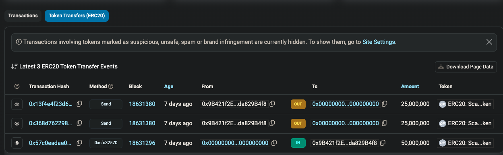

Flag: `SCAN2024{0x57c0eadae093984edc965019df83c3880a6fd7154fc04c3760dd353229d95109}`

## ScanToken - 3

### Description

In `SCANToken - 1`, the attacker wrapped the `ScanToken` into a `ScanRebasingToken` and transferred the tokens to the attacker's address on Optimism Sepolia via LayerZero. From that address, the `ScanRebasingToken` was sent to another addresses. You need to find all the transactions received from other attacker addresses.

**Flag Format (case-insensitive):** `SCAN2024{TransactionHash_TransactionHash_...}` (TransactionHashes must be in ascending order)

ex) `SCAN2024{0x0000000000000000000000000000000000000000000000000000000000000001_0x0000000000000000000000000000000000000000000000000000000000000002_...}`

### Solution

攻撃者が、Optimism Sepolia のアドレスから、さらに別の複数のアドレスに送金したため、その受信トランザクションを特定せよ、という問題。

先程の履歴で、2つの送金トランザクションがあった:
- https://sepolia-optimistic.etherscan.io/tx/0x368d7622988f4641d9e1ffc5bc0c24831b9b44c1e4a35a353f94a66e54fef145
- https://sepolia-optimistic.etherscan.io/tx/0x13f4e4f23d6d3cff197939b5f05e05714b0e44edd3b93513133d140d0aa3d300

さっきの要領でトランザクションを読むと、両方とも Polygon Amoy Testnet (`dstEid` が `40267`) への送金で、それぞれ以下のアドレスへの送金だとわかる:
- https://amoy.polygonscan.com/address/0xdf1d2b4f4b432b74fb350315735e03196098ce43
- https://amoy.polygonscan.com/address/0xafd6d08aa9d5ad513c1445c4a95776080fd04fcc

そして、それぞれの受信トランザクションは以下:
- https://amoy.polygonscan.com/tx/0x1f6689e270ba42e8b367f03c2c7515a3a2673fbb91916b6616801fc5945d2b75
- https://amoy.polygonscan.com/tx/0x9f221b60816d6e4a454bb0777f59e7a9b3ed542f6dab621e9ea405a6bbd506aa

これらトランザクションハッシュを結合すれば答え。

Flag: `SCAN2024{0x1f6689e270ba42e8b367f03c2c7515a3a2673fbb91916b6616801fc5945d2b75_0x9f221b60816d6e4a454bb0777f59e7a9b3ed542f6dab621e9ea405a6bbd506aa}`

## ScanToken - 4

### Description
To receive `ScanRebasingToken`, the attacker called a function of specific contract from an address one hop before the final attacker address. (The address that received the token in the flag transaction of the previous challenge is not the _final_ attacker address.)

Identify the specific contract address and function selector.

**Flag Format (case-insensitive):** `SCAN2024{ContractAddress_FunctionSelector}`

ex) `SCAN2024{0x0000000000000000000000000000000000031337_0x37aeb54d}`

### Solution

攻撃者が、`ScanRebasingToken`を受け取るために、あるアドレスからあるコントラクトのある関数を呼び出したとのこと。
そして、そのアドレスは攻撃者の最後のアドレスから1 hop前のアドレスであることが示されている。
ゴールはその呼び出されたコントラクトと関数を特定すること。

「`ScanRebasingToken` を受け取るため」とあるので、[ScanRebasingToken の送金履歴](https://amoy.polygonscan.com/token/0x90cd8b4deb62005c98b92045d4e2350129ee65b3)を見る:

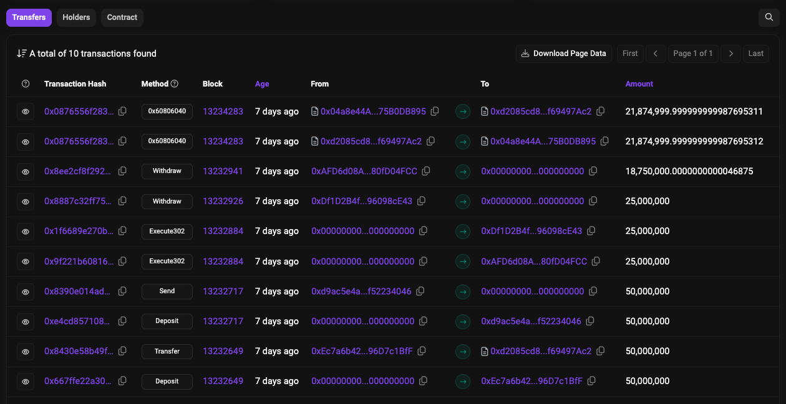

`Withdraw`メソッドのトランザクションは、先程の Optimism Sepolia から送られてきた `ScanRebasingToken` を `ScanToken` に変えるためのトランザクションである。
そして、それ以前のトランザクションは既に調査したトランザクションなので特に関係ないように見える。

つまり、[最新のトランザクション](https://amoy.polygonscan.com/tx/0x0876556f28360b64bd85c10ceb47a830b809552b5122d839ffef37427fa2eba6)が怪しい。
このトランザクションでコントラクトを生成しており、2回の送金が行われている。
トークンの送受金履歴を見ると、流動性プールと対話して以下の4つの送金が行われている:
- 流動性プールから攻撃者がデプロイしたコントラクトへ `ScanRebasingToken` が約 21,875,000 送金
- 流動性プールから攻撃者がデプロイしたコントラクトへ `ScanUSDC` が 0 送金
- 攻撃者がデプロイしたコントラクトから流動性プールへ `ScanRebasingToken` が約 21,875,000 送金
- 流動性プールからトランザクションの送信元アドレスへ `ScanUSDC` が約 218,256,950 送金

そして、このトランザクションの送信元アドレス `0x33c9b342208B519f5E6f91661BD08591458A830d` が最終的な攻撃者アドレスだろうというのはわかった。

ここまでは良かったが、問題文の「one hop before」というのが不明瞭で、かつ、「To receive `ScanRebasingToken`」という問題文に騙されて、上記の送金履歴に載っていないトランザクションを探して時間を浪費した。
結局 1 hop前 というのは単に上記のトランザクションで生成したコントラクトであり、receiveというのは最初の送金のことで、このトランザクションを調べれば良かっただけだった。
（自分が問題作るなら、簡単になってもいいからもう少し問題文を厳密にするなと思った。あと我々が解いた後に問題文が若干改善されていたが、フェアじゃない。）

```
$ cast run 0x0876556f28360b64bd85c10ceb47a830b809552b5122d839ffef37427fa2eba6
Executing previous transactions from the block.
Traces:
  [580138] → new <unknown>@0x04a8e44Af5cA157a87621b3FD27120c75B0DB895
    ├─ [70136] 0xd2085cd8e31cB6f938498DB0fd1D48bf69497Ac2::skim(0x04a8e44Af5cA157a87621b3FD27120c75B0DB895)

...
```

ということで、流動性プールの`skim(address to)`関数を呼び出しているので、これが答え。
ちなみに `skim` 関数は「トークン残高 > リザーブ」の不一致になった場合に`to`にトークンを送金することで一致させる Uniswap V2 の機能。

Flag: `SCAN2024{0x04a8e44Af5cA157a87621b3FD27120c75B0DB895_0xbc25cf77}`

## ScanToken - 5

### Description
For anti-computer forensics purposes, the attacker sent laundering transactions from a virtual machine and immediately discarded the private keys of all addresses except for the final destination address. However, the attacker made a mistake by performing a specific step in the wrong order (earlier than it should have been), causing them to acquire less `ScanUSDC` than they could.

Identify the transaction that was prematurely sent by mistake, and the function selector in it. (Assume that the transactions sent by the attacker do not contain incorrect calldata, and the only thing wrong is the ordering.)

**Flag Format (case-insensitive):** `SCAN2024{TransactionHash_FunctionSelector}`

ex) `SCAN2024{0x94c967846c26420d22aa2e6962b28b4a6366126023afe25611286490babe4365_0x37aeb54d}`

### Solution

攻撃者はミスをして、本来よりも少ない量の `ScanUSDC` を入手することになり、その原因はトランザクションの送信順序を間違えたかららしい。
そしてゴールは、その誤って早く送信してしまったトランザクションと、その中で呼び出した関数セレクタを特定すること。

雑に調査するのが大変になってきたので、一旦今までわかったことを時系列に整理する:
- 07:37:12
    - https://amoy.polygonscan.com/tx/0xccf224c7966717780b5cf1e070488068eca9e095fd2ce0bacdefde42f27891b1
        - 被害者が `ScanToken` を作成＆100Mミント
- 07:37:16
    - https://amoy.polygonscan.com/tx/0xd781309951910a769f5470eeeb18b99414a1b4de37294b9d260b464273fd3ff1
        - 被害者が `ScanRebasingToken` を作成
- 07:45:14
    - https://amoy.polygonscan.com/tx/0x1efa50d42b315076a13f302d48b84b745bb3b2aea2e8b3b781b8ffedaaa0eba6
        - 被害者が `ScanUSDC` を作成＆500Mミント
- 07:47:46
    - https://amoy.polygonscan.com/tx/0x667ffe22a30909cc36c9024452161d50df63378df36640dad6cded5382dd419d
        - 被害者が 50M の `ScanToken` を 50M の `ScanRebasingToken` に変換
    - https://amoy.polygonscan.com/tx/0x8430e58b49f4640dd4a47aa6457ea97af6545015187756e69d484aa301cca388
        - 被害者が `ScanRebasingToken` を流動性プールに 50M 送金
    - https://amoy.polygonscan.com/tx/0x878850080d2504061aa180c032dc9a48e445bd5f3132f4149e25f16f505eed4d
        - 被害者が `ScanUSDC` を流動性プールに 500M 送金
    - https://amoy.polygonscan.com/tx/0x4026925761a109a7bd41807b51e31b2f8a084dcd609e4d66857a3ecfe8d2a965
        - 被害者が流動性プールのトークンをミント
    - https://amoy.polygonscan.com/tx/0x1e637fbf058a21ee52bec6e37e08700c1b995d9917a0f0af9dba6b8846e32048
        - 被害者がエアドロップ用アドレスに `ScanToken` を 50M 送金
- 07:50:10
    - https://amoy.polygonscan.com/tx/0xe4cd857108994fd8d09d80abd8bfb035832abc235af91a131145dd9bea70eba5
        - 攻撃者がエアドロップ用アドレスにて不正に `ScanToken` を `ScanRebasingToken` に 50M 分変換
    - https://amoy.polygonscan.com/tx/0x8390e014ad0178d6868c21b082bf44f75a9ea4ad233297fd6708711c33f47e6e
        - 攻撃者がエアドロップ用アドレスから `ScanRebasingToken` を Optimism Sepolia の攻撃者のアドレスに $50M 送金
- 07:52:12
    - https://sepolia-optimistic.etherscan.io/tx/0x57c0eadae093984edc965019df83c3880a6fd7154fc04c3760dd353229d95109
        - 攻撃者が `ScanRebasingToken` を 50M 受け取り
- 07:55:00
    - https://sepolia-optimistic.etherscan.io/tx/0x368d7622988f4641d9e1ffc5bc0c24831b9b44c1e4a35a353f94a66e54fef145
        - 攻撃者が `ScanRebasingToken` を Polygon Amoy Testnet の攻撃者アドレスAに 25M 送金
    - https://sepolia-optimistic.etherscan.io/tx/0x13f4e4f23d6d3cff197939b5f05e05714b0e44edd3b93513133d140d0aa3d300
        - 攻撃者が `ScanRebasingToken` を Polygon Amoy Testnet の攻撃者アドレスBに 25M 送金
- 07:56:06
    - https://amoy.polygonscan.com/tx/0x1f6689e270ba42e8b367f03c2c7515a3a2673fbb91916b6616801fc5945d2b75
        - 攻撃者が `ScanRebasingToken` をアドレスAにて 25M 受け取り
    - https://amoy.polygonscan.com/tx/0x9f221b60816d6e4a454bb0777f59e7a9b3ed542f6dab621e9ea405a6bbd506aa
        - 攻撃者が `ScanRebasingToken` をアドレスBにて 25M 受け取り
- 07:57:34
    - https://amoy.polygonscan.com/tx/0x8887c32ff7588db3309a08b7a62959fe02e6d3e8ae10daf93729c3969c27b65a
        - 攻撃者がアドレスAにて 25M の `ScanRebasingToken` を 25M の `ScanToken` に変換
    - https://amoy.polygonscan.com/tx/0xa4f0141a3ed10be2c0030e66184cb0f855b4ba85e94f454208a1a1130393884f
        - 攻撃者がアドレスAの `ScanToken` を `ScanRebasingToken` のアドレスに 25M 送金
- 07:58:06
    - https://amoy.polygonscan.com/tx/0x8ee2cf8f292d44d8021d01a4a79b57f606f6ee18da45567dee4c354b50ab4a44
        - 攻撃者がアドレスBにて 約18.75M の `ScanRebasingToken` を 25M の `ScanToken` に変換
    - https://amoy.polygonscan.com/tx/0xe0c74ac64f46c62e17ae8770153d4db4ce6597912ee93b88a1b200009dd0c05f
        - 攻撃者がアドレスBの `ScanToken` を `ScanRebasingToken` のアドレスに 25M 送金
- 08:45:38
    - https://amoy.polygonscan.com/tx/0x0876556f28360b64bd85c10ceb47a830b809552b5122d839ffef37427fa2eba6
        - 攻撃者が skim 関数を呼び出して、ScanUSDC を 218M 取得

これらトランザクションの中で順序で結果が変わりそうなのは、 07:57:34 と 07:58:06 あたりのトランザクションのように見える。
先に `ScanToken` を変換してから `ScanRebasingToken` のアドレスに送ったほうが良さそうで、これが答え（細かい挙動見たら何が起きてるかわかるけど、解くだけならそこまで踏み込む必要はない）。

Flag: `SCAN2024{0xa4f0141a3ed10be2c0030e66184cb0f855b4ba85e94f454208a1a1130393884f_0xa9059cbb}`

## Bridge - 1

### Description

**Intro**

When a user performs a withdrawal, `MockBridge` ([https://sepolia.etherscan.io/address/0x39954De76b4F64E7eA5D7f906fCD943dcEF6f9Bb](https://sepolia.etherscan.io/address/0x39954De76b4F64E7eA5D7f906fCD943dcEF6f9Bb)) collects multiple signatures from registered operators and mints new tokens. However, due to an incorrect Implementation contract upgrade by the developer, a vulnerability occurred in the bridge, leading to the theft of the bridge's assets. Analyze the process of this incident.

**Task**

`MockBridge` approves a withdrawal transaction when the total weight of the submitted signatures' signers exceeds a specific threshold. Currently, from the bridgeManager contract of `MockBridge`, find all operator addresses whose weight is greater than 0, and submit the found operator addresses sorted in ascending order (e.g., address1, address2 when address1 < address2).

**Flag Format (case-insensitive, no-whitespace):** `SCAN2024{address1, address2, address3,...}`

### Solution

シナリオの整理:
- ユーザーが引き出しを行う際に、`MockBridge`コントラクトは複数のオペレーターからの署名を収集しており、署名者の重みが一定の閾値を満たすとトークンをミントする
- しかし開発者による誤った実装コントラクトのアップグレードが原因で、ブリッジに脆弱性が存在している
- 攻撃者はその脆弱性を悪用して資産を不正に獲得した

問題のゴールは、`MockBridge` の `bridgeManager` コントラクトから、`0` より大きい重みを持つ全てのオペレーターアドレスを抽出すること。

まずは、[実装コントラクト](https://sepolia.etherscan.io/address/0x631ce2e6c6676a0c258c9c4897a1112f4f18f460)を見てみる:

```solidity
contract MockBridgeNew is IMockBridge {

    mapping(uint256 => bytes32) public withdrawalHash;
    uint96 private _totalOperatorWeight;
    BridgeManager private bridgeManager; 
```

`private` 変数で `bridgeManager` がある。
また、`addBridgeOperators`という関数でオペレーターを追加していることがわかる:

```solidity
    function addBridgeOperators(address[] memory addrs) private {
        uint96[] memory weights = new uint96[](addrs.length); 
        for(uint i=0; i < weights.length; i++) {
            weights[i] = 100;
        }

        bridgeManager.addBridgeOperators(weights, addrs);
    }
```

また、`BridgeManager` コントラクトには `getBridgeOperators` 関数が実装されている:

```solidity
    function getBridgeOperators() public view returns (address[] memory) {
        return _getBridgeManagerStorage()._operators;
    }
```

加えて、プロキシコントラクトのデプロイ時のトランザクションは https://sepolia.etherscan.io/tx/0x1bc4efad59b7afe71ba61a0445fc2eb9171f581194d54c2f884d83f66aea3e50 であり、コントラクトをデプロイしたアドレスは https://sepolia.etherscan.io/address/0xf271153e1e47af9e5caedd12e1a893659d29100c であることもわかる。

そこで、`bridgeManager`コントラクトのアドレスを取得して、`getBridgeOperators`関数を呼び出し、オペレーターを取得しようと思った。
が、デプロイ時のトランザクションを見ると、`BridgeOperatorsAdded` イベントが起きていることがわかったので、これをそのまま利用した:

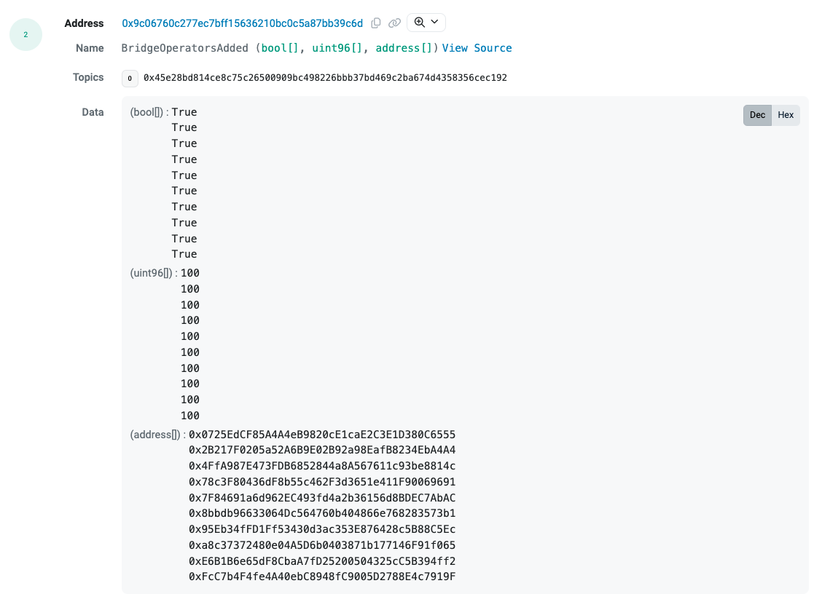

特にオペレーターの更新もなくこれが答え。

Flag: `SCAN2024{0x0725EdCF85A4A4eB9820cE1caE2C3E1D380C6555,0x2B217F0205a52A6B9E02B92a98EafB8234EbA4A4,0x4FfA987E473FDB6852844a8A567611c93be8814c,0x78c3F80436dF8b55c462F3d3651e411F90069691,0x7F84691a6d962EC493fd4a2b36156d8BDEC7AbAC,0x8bbdb96633064Dc564760b404866e768283573b1,0x95Eb34fFD1Ff53430d3ac353E876428c5B88C5Ec,0xa8c37372480e04A5D6b0403871b177146F91f065,0xE6B1B6e65dF8CbaA7fD25200504325cC5B394ff2,0xFcC7b4F4fe4A40ebC8948fC9005D2788E4c7919F}`

## Bridge - 2

### Description
`MockBridge` is an Upgradable contract. Find. the transaction that recently changed the Implementation of the Proxy contract. This transaction executed a specific function in the Implementation contract code along with the Implementation change. Submit the 4-byte signature of the executed Implementation function (e.g., 0x12345678).

**Flag Format (case-insensitive):** `SCAN2024{4-byte signature}`

### Solution

実装コントラクトの変更とともに実装コントラクトの特定の関数を呼び出しており、その関数セレクタを答えよ、という問題。

アップグレードイベントを調査すれば良いので、[プロキシコントラクトのイベント一覧](https://sepolia.etherscan.io/address/0x39954de76b4f64e7ea5d7f906fcd943dcef6f9bb#events)から`Upgraded`イベントをフィルタする:

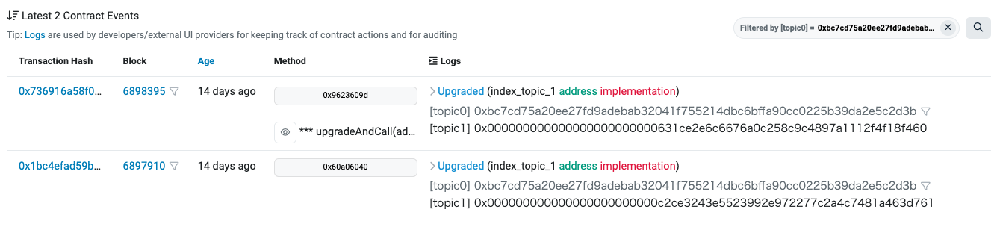

[このトランザクション](https://sepolia.etherscan.io/tx/0x736916a58f0e010c1e8a61f97bae68c7a7fc313dec36cb118869a3494291554b#eventlog)で、`0x631ce2E6c6676a0C258C9c4897A1112F4f18f460`にアップグレードされていることがわかる。
また、`upgradeAndCall`関数が実行されているので、なにか関数を呼び出していそう。

トランザクションをトレースする:
```
$ cast run (pbpaste) --quick
Traces:
  [22854] 0x9B668e7840F1681a8c061b9376409AF7e7e2ad5C::upgradeAndCall(0x39954De76b4F64E7eA5D7f906fCD943dcEF6f9Bb, 0x631ce2E6c6676a0C258C9c4897A1112F4f18f460, 0x54a08606)
    ├─ [16751] 0x39954De76b4F64E7eA5D7f906fCD943dcEF6f9Bb::upgradeToAndCall(0x631ce2E6c6676a0C258C9c4897A1112F4f18f460, 0x54a08606)
    │   ├─ emit Upgraded(param0: 0x631ce2E6c6676a0C258C9c4897A1112F4f18f460)
    │   ├─ [6325] 0x631ce2E6c6676a0C258C9c4897A1112F4f18f460::initializeV4() [delegatecall]
    │   │   ├─ emit Upgrade(: 4)
    │   │   └─ ← [Stop] 
    │   └─ ← [Stop] 
    └─ ← [Stop] 


Transaction successfully executed.
Gas used: 45110
```

`0x54a08606`が関数セレクタである`initializeV4`関数が答えだとわかった。

Flag: `SCAN2024{0x54a08606}`

## Bridge - 3

### Description
Due to the developer's incorrect function call in the transaction from question 2, a vulnerability occurred in the bridge's withdrawal function. In this `TX`([https://sepolia.etherscan.io/tx/0x62bdce8f43b613d7ea87bd39b9691e678eabf19c99c0deaef0a1f742fcd235fc](https://sepolia.etherscan.io/tx/0x62bdce8f43b613d7ea87bd39b9691e678eabf19c99c0deaef0a1f742fcd235fc)), the bridge was attacked, and approximately "9,998,202,760" tokens([https://sepolia.etherscan.io/token/0x10e5dfcc26f98285c8c57b9922b3f43806e8b689](https://sepolia.etherscan.io/token/0x10e5dfcc26f98285c8c57b9922b3f43806e8b689)) were stolen. Find the addresses of the signers who signed the withdrawal data receipt in the transaction. If there are multiple addresses, submit them sorted in ascending order, as in question 1.

**Flag Format (case-insensitive):** `SCAN2024{address1,address2...}`

### Solution

前の質問のアップグレードトランザクションで開発者がミスをしていたことで、ブリッジの引き出し関数に脆弱性が生まれてしまっているらしい。
そして、ブリッジが攻撃されトークンが盗まれてしまったので、その攻撃トランザクションに含まれる引き出しデータのレシートに署名したアドレスを見つけよ、という問題。

とりあえず与えられた攻撃トランザクションをトレースする:

```
$ cast run (pbpaste) --quick
Traces:
  [91467] 0x39954De76b4F64E7eA5D7f906fCD943dcEF6f9Bb::submitWithdrawal((335, 1, (0x2C8e1b95A624e433A85092bC4850d7dB9FABDCFb, 0x10e5dFCC26F98285c8c57B9922B3f43806e8B689, 11155111 [1.115e7]), (0x2C8e1b95A624e433A85092bC4850d7dB9FABDCFb, 0x10e5dFCC26F98285c8c57B9922B3f43806e8B689, 11155111 [1.115e7]), (0, 335, 9998202760081153176322100802 [9.998e27])), [(28, 0xd8762f177991811a89a69279a0df4c2c31083274001166494aa582c359ffe962, 0x1c492624b475869a1370c9d1b13c59a8331d2353cc87022cab6664acb1012810)])
    ├─ [86432] 0x631ce2E6c6676a0C258C9c4897A1112F4f18f460::submitWithdrawal((335, 1, (0x2C8e1b95A624e433A85092bC4850d7dB9FABDCFb, 0x10e5dFCC26F98285c8c57B9922B3f43806e8B689, 11155111 [1.115e7]), (0x2C8e1b95A624e433A85092bC4850d7dB9FABDCFb, 0x10e5dFCC26F98285c8c57B9922B3f43806e8B689, 11155111 [1.115e7]), (0, 335, 9998202760081153176322100802 [9.998e27])), [(28, 0xd8762f177991811a89a69279a0df4c2c31083274001166494aa582c359ffe962, 0x1c492624b475869a1370c9d1b13c59a8331d2353cc87022cab6664acb1012810)]) [delegatecall]
    │   ├─ [3000] PRECOMPILES::ecrecover(0x4437673f8c6eafda398a496a79dab22e77a9ecfe7e8464c6c884f09a012c67ae, 28, 97908388262589106034177424925970229609520331399116080370962881030736159172962, 12794002851984098794849830790922042075488407342091227270018682347185483360272) [staticcall]
    │   │   └─ ← [Return] 0x0000000000000000000000001a25d7003bc53df359ef68f5ca86b2a23926738c
    │   ├─ [31829] 0x10e5dFCC26F98285c8c57B9922B3f43806e8B689::mint(0x2C8e1b95A624e433A85092bC4850d7dB9FABDCFb, 9998202760081153176322100802 [9.998e27])
    │   │   ├─ emit Transfer(param0: 0x0000000000000000000000000000000000000000, param1: 0x2C8e1b95A624e433A85092bC4850d7dB9FABDCFb, param2: 9998202760081153176322100802 [9.998e27])
    │   │   └─ ← [Stop] 
    │   ├─ emit Withdrew(: 0xc69d775a3780b8b33c04c802d887891d00351967101e10e601fd6765a328658f, : (335, 1, (0x2C8e1b95A624e433A85092bC4850d7dB9FABDCFb, 0x10e5dFCC26F98285c8c57B9922B3f43806e8B689, 11155111 [1.115e7]), (0x2C8e1b95A624e433A85092bC4850d7dB9FABDCFb, 0x10e5dFCC26F98285c8c57B9922B3f43806e8B689, 11155111 [1.115e7]), (0, 335, 9998202760081153176322100802 [9.998e27])))
    │   └─ ← [Return] 0x0000000000000000000000001a25d7003bc53df359ef68f5ca86b2a23926738c
    └─ ← [Return] 0x0000000000000000000000001a25d7003bc53df359ef68f5ca86b2a23926738c


Transaction successfully executed.
Gas used: 116619
```

`submitWithdrawal`関数を呼び出している。
この関数は`MockBridgeImplNew`に実装されている:
```solidity
    function submitWithdrawal(Receipt calldata _receipt, Signature[] calldata _signatures) external whenNotPaused returns (address signer) {
        return _submitWithdrawal(_receipt, _signatures);
    }
```

これによりコールデータが以下であることがわかる:
```
_receipt: (335, 1, (0x2C8e1b95A624e433A85092bC4850d7dB9FABDCFb, 0x10e5dFCC26F98285c8c57B9922B3f43806e8B689, 11155111 [1.115e7]), (0x2C8e1b95A624e433A85092bC4850d7dB9FABDCFb, 0x10e5dFCC26F98285c8c57B9922B3f43806e8B689, 11155111 [1.115e7]), (0, 335, 9998202760081153176322100802 [9.998e27])), 
_signatures: [(28, 0xd8762f177991811a89a69279a0df4c2c31083274001166494aa582c359ffe962, 0x1c492624b475869a1370c9d1b13c59a8331d2353cc87022cab6664acb1012810)]
```

`Signature`構造体の実装は以下:
```solidity
    struct Signature {
        uint8 v;
        bytes32 r;
        bytes32 s;
    }
```

つまり、一つのアドレスが署名していることがわかる。
また、トランザクションのトレースで`ECRECOVER`プリコンパイルが呼び出されている:
```
    │   ├─ [3000] PRECOMPILES::ecrecover(0x4437673f8c6eafda398a496a79dab22e77a9ecfe7e8464c6c884f09a012c67ae, 28, 97908388262589106034177424925970229609520331399116080370962881030736159172962, 12794002851984098794849830790922042075488407342091227270018682347185483360272) [staticcall]
    │   │   └─ ← [Return] 0x0000000000000000000000001a25d7003bc53df359ef68f5ca86b2a23926738c
```

ここから、 `0x1a25d7003bc53df359ef68f5ca86b2a23926738c` が答えだとわかる。

Flag: `SCAN2024{0x1a25d7003bc53df359ef68f5ca86b2a23926738c}`

## Bridge - 4

### Description
In question 3, the signers who signed the withdrawal data are not registered operator signers of the bridge. Find the hash value of the first transaction that performed a withdrawal using signatures from addresses other than the operators registered in the bridge.

**Flag Format (case-insensitive):** `SCAN2024{TransactionHash}`

### Solution

前の問題から、署名者が登録されたオペレーターではないことがわかる。
そして、オペレーターとして登録されていないアドレスに対して、引き出しが最初に行われたトランザクションを見つけよという問題。

つまり、前のトランザクションは攻撃トランザクションの一つだったということ。

[プロキシコントラクトに関連するトランザクション一覧](https://sepolia.etherscan.io/address/0x39954de76b4f64e7ea5d7f906fcd943dcef6f9bb)を見てみると、`submitWithdrawal`関数を呼び出すトランザクションが200個ほどある。
試しに[最初のトランザクション](https://sepolia.etherscan.io/tx/0x0bb90cd69411538f99bdcd79f7498d3b305552f3e15f32525044d66260c86726)を調べたら、登録されているオペレーターだったので、真面目に調べないといけない。

Google Big Query を使ってもいいけど、これくらいであれば Etherscan からトランザクション一覧を雑にコンソールから取得して cast でトレースするのが手っ取り早いと判断。

コンソールで取得:
```javascript
let txHashList = "";
const trs = document.querySelectorAll("tr");
for (let tr of trs) {
    const a = tr.querySelector("a");
    const txHash = a.href.split("/")[4];
    if (txHash)
        txHashList = '"' + txHash + '",' + txHashList;
}
console.log(txHashList);
```

以下を実行:
```python
import subprocess
from bridge4_txlist import txlist
from tqdm import tqdm

registered_operators = [
    "0x0725EdCF85A4A4eB9820cE1caE2C3E1D380C6555",
    "0x2B217F0205a52A6B9E02B92a98EafB8234EbA4A4",
    "0x4FfA987E473FDB6852844a8A567611c93be8814c",
    "0x78c3F80436dF8b55c462F3d3651e411F90069691",
    "0x7F84691a6d962EC493fd4a2b36156d8BDEC7AbAC",
    "0x8bbdb96633064Dc564760b404866e768283573b1",
    "0x95Eb34fFD1Ff53430d3ac353E876428c5B88C5Ec",
    "0xa8c37372480e04A5D6b0403871b177146F91f065",
    "0xE6B1B6e65dF8CbaA7fD25200504325cC5B394ff2",
    "0xFcC7b4F4fe4A40ebC8948fC9005D2788E4c7919F",
]

for txhash in tqdm(txlist):
    cmd = f"cast run {txhash} --quick"
    result = subprocess.check_output(cmd, shell=True).decode("utf-8")
    for line in result.split("\n"):
        if "[Return]" not in line:
            continue
        if any(
            operator.lower() in line.lower().replace("0x000000000000000000000000", "0x")
            for operator in registered_operators
        ):
            break
        print(txhash)
        exit(0)
```

Flag: `SCAN2024{0x83e3bc8d5c9c53a295cdc2203817801fe5424cde7034661c9fd0a61e221a6703}`

## Bridge - 5

### Description

Fortunately, in the `attack transaction`(https://sepolia.etherscan.io/tx/0x62bdce8f43b613d7ea87bd39b9691e678eabf19c99c0deaef0a1f742fcd235fc) from question 3, the MEV bot front-ran the actual malicious attacker's transaction and stole the bridge's funds first. Find the hash value of the original attack transaction that the MEV bot front-ran. In the original attack transaction, the signatures submitted for the withdrawal were also signed by addresses that were not registered as operators in the bridge.

**Flag Format (case-insensitive):** `SCAN2024{TransactionHash}`

### Solution

問3の攻撃トランザクションが実は MEV bot によってフロントランされたものだから、もともとのフロントランされてしまった攻撃トランザクションを特定せよ、という問題。

とりあえず、攻撃トランザクションと同じブロックを見たが特に失敗しているトランザクションは見つけられなかった。
そもそも `submitWithdrawal` 関数を呼び出しているトランザクション一覧に失敗しているトランザクションがないので、コントラクト経由で `submitWithdrawal` 関数は呼び出している可能性が高い。

このトランザクションがやっていることは、結局 `MockUSD` トークンを送金していることなのだから、 `MockUSD` トークンの送受金履歴を見てみる:

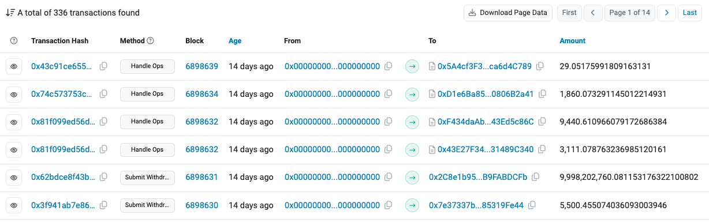

`Handle Ops` 関数を呼び出している謎のトランザクションがある。

でも特におかしなトランザクションが見当たらない。
ここで、 Etherscan は Advanced Mode というのがあることを思い出す:

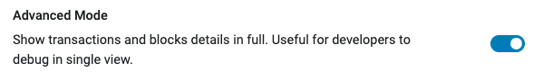

これをオンにしないと一部のトランザクションが表示されないことがある。
例えば 0 transfer が表示されないなどのフィルタリングがされる。
こういう系の競技だったら絶対に ON すべきオプション。
あと Site Settings には右上のダークビューに切り替えるボタンから飛ぶんだけど、かなり Bad UI なので注意。
ただ、今回はこれをオンにしても、特に目立ったなにかは見つけられなかった。

おそらく同じブロックに攻撃トランザクションとフロントラントランザクションがあるわけではないとわかるので、 `Handle Ops` のトランザクションと MEV bot のトランザクションを見比べてみることにした。
よく考えたら MEV bot が、自発的に攻撃することは当然無いので、 `Handle Ops` の失敗したトランザクションと MEV bot の成功したトランザクションが一対一に結びついているのではないかと予想した（一般的なフロントランの挙動と違うけど）。

まず、[最初に Handle Ops が失敗しているトランザクション](https://sepolia.etherscan.io/tx/0x3006b17105af028065d6bfb4f02faa084ea43be63e29a5e3ed140bfffb6c34e7)は Out-of-Gas で revert しているから単に攻撃者がミスっただけだろうと推測。

[2番目に Handle Ops が失敗しているトランザクション](https://sepolia.etherscan.io/tx/0x81f099ed56d9ad4c3e7188be80f21dbce0db027e44ad506d27fc6db8da015b76)は `submitWithdrawal` 関数の実行時に、`ErrReachedDailyWithdrawalLimit` エラーが出ている。 
これがフロントランされた証だと推測。

ただ前の問題で判明した [最初の不正なトランザクション](https://sepolia.etherscan.io/tx/0x83e3bc8d5c9c53a295cdc2203817801fe5424cde7034661c9fd0a61e221a6703) を調べても、特に額などは一致していなさそう。

困ったなと思っていたが、攻撃トランザクションをトレースしていると、`submitWithdrawal` 関数が複数回呼ばれており、 `submitWithdrawal` 関数の最初の引数の構造体の最初のメンバーが単調増加していることに気づく:

```
├─ [15827] 0x631ce2E6c6676a0C258C9c4897A1112F4f18f460::submitWithdrawal((349, 1, ...
...
├─ [15827] 0x631ce2E6c6676a0C258C9c4897A1112F4f18f460::submitWithdrawal((350, 1, ...
```

そこで `MockBridge` コントラクトを見てみると、`Receipt`という構造体が最初の引数であることがわかった:

```solidity
    struct Receipt {
        uint256 id;
        Kind kind;
        TokenOwner mainchain;
        TokenOwner ronin;
        TokenInfo info;
    }
```

もしフロントランされたのなら、この `id` が一致するのではないか？と予想した。
しかし、失敗している攻撃トランザクションのほうが MEV bot のトランザクションよりも `id` が後ろになっていて、攻撃トランザクションが MEV bot のフロントランの後に実行されていることがほぼほぼ確定した。

ちなみにこのような感じ:
```
id: 335
kind: 1
mainchain: (0x2C8e1b95A624e433A85092bC4850d7dB9FABDCFb, 0x10e5dFCC26F98285c8c57B9922B3f43806e8B689, 11155111 [1.115e7])
ronin: (0x2C8e1b95A624e433A85092bC4850d7dB9FABDCFb, 0x10e5dFCC26F98285c8c57B9922B3f43806e8B689, 11155111 [1.115e7])
info: (0, 335, 9998202760081153176322100802 [9.998e27]))
```

詰みかけたが、一旦前の問題のスクリプトをちょっとだけ変えて、全ての不正な`submitWithdrawal`関数を呼び出すトランザクションを抜き出して整理することにした。
すると以下の2つのトランザクションしか MEV bot によるものではないとわかった:

```
0x83e3bc8d5c9c53a295cdc2203817801fe5424cde7034661c9fd0a61e221a6703
submitWithdrawal((111, 1, (0x7A3Ce4D0184a36017704b76D5f2958CE84A70cb3, 0x10e5dFCC26F98285c8c57B9922B3f43806e8B689, 11155111 [1.115e7]), (0x7A3Ce4D0184a36017704b76D5f2958CE84A70cb3, 0x10e5dFCC26F98285c8c57B9922B3f43806e8B689, 11155111 [1.115e7]), (0, 111, 0)), [(28, 0xd6762b170da5c56ff83888729cedd0f4e0aedbcdc6579a66f1f6fdb245cfca7e, 0x6b36e4143f927a1a3a894b98fcac0d3676d960c6696f93788a33a0bdaf1954e0)]
```

```
0x62bdce8f43b613d7ea87bd39b9691e678eabf19c99c0deaef0a1f742fcd235fc
submitWithdrawal((335, 1, (0x2C8e1b95A624e433A85092bC4850d7dB9FABDCFb, 0x10e5dFCC26F98285c8c57B9922B3f43806e8B689, 11155111 [1.115e7]), (0x2C8e1b95A624e433A85092bC4850d7dB9FABDCFb, 0x10e5dFCC26F98285c8c57B9922B3f43806e8B689, 11155111 [1.115e7]), (0, 335, 9998202760081153176322100802 [9.998e27])), [(28, 0xd8762f177991811a89a69279a0df4c2c31083274001166494aa582c359ffe962, 0x1c492624b475869a1370c9d1b13c59a8331d2353cc87022cab6664acb1012810)]
```

しかも、1つ目は前の問題で答えさせられたもので、2つ目はこの問題で与えられたトランザクション。
つまり、トランザクションを見比べる戦略はそもそも意味がなく、`Handle Ops` の中で revert しているトランザクションは、MEV bot と（厳密には今回の問題とは）あまり関係なさそうということがわかった。

そこで、`Handle Ops` かつ中身で revert しているトランザクションの `submitWithdrawal` の引数を抜き出してみて、トークンの amount などに何か特徴がないか確認することにした:

```python
import subprocess
import re
from bridge5_txlist import handleops_txlist as txlist

registered_operators = [
    "0x0725EdCF85A4A4eB9820cE1caE2C3E1D380C6555",
    "0x2B217F0205a52A6B9E02B92a98EafB8234EbA4A4",
    "0x4FfA987E473FDB6852844a8A567611c93be8814c",
    "0x78c3F80436dF8b55c462F3d3651e411F90069691",
    "0x7F84691a6d962EC493fd4a2b36156d8BDEC7AbAC",
    "0x8bbdb96633064Dc564760b404866e768283573b1",
    "0x95Eb34fFD1Ff53430d3ac353E876428c5B88C5Ec",
    "0xa8c37372480e04A5D6b0403871b177146F91f065",
    "0xE6B1B6e65dF8CbaA7fD25200504325cC5B394ff2",
    "0xFcC7b4F4fe4A40ebC8948fC9005D2788E4c7919F",
]

pattern = re.compile(r"submitWithdrawal\(\((.+)\), \[(.+)\]\)")
v = set()

for txhash in txlist:
    cmd = f"cast run {txhash} --quick"
    result = subprocess.check_output(cmd, shell=True).decode("utf-8")
    print(txhash)
    for line in result.split("\n"):
        if "submitWithdrawal" in line:
            match = pattern.search(line)
            receipt, signature = match.groups()
            amount = int(receipt.split(",")[-1].strip().split(" ")[0])
            v.add((txhash, amount))

print(sorted(list(v), key=lambda x: x[1]))
```

最終的な出力（一部省略）:
```
...
('0x6adf219f19fb3bf9f8a30c37e437115a96ffe4e5e42f2fbab69b783db8774e27', 9968263016876162175863), ('0x2381535f33754b85d539a5460aa139be0b2488c9f92c63f1be779ac4bcab48f0', 9968263016876162175863), ('0xd7fc1ff10650b7d19779d213d32ae49a49d7e7431321c75c5087f1a2960333b1', 9968263016876162175863), ('0x5010cd76611d27270521fbbc601ae1c1fd0c68948d26c6a21feed008d02fb1cd', 9968263016876162175863), ('0x01213af9da86d31b201f24a2e8fe572fed9b14cf5d063265fc582701797d8b44', 9973311854116787525962), ('0xea8631eb6d1630abfa46e62217122cac40a9d0dd6fe6d31cc5b05f2f605a9781', 9973311854116787525962), ('0xcbe9b6502fcedef361d498de44222f51ff3a4b84d08a1bfe352cc39a61b37cb8', 9973311854116787525962), ('0xa32e1961a90d3583601e7786319e4861b958604c17c434582ae683a90e3905c3', 9997202760081153176322100802)]
```

となっており、一つだけ突出したamountを指定したトランザクションがある。
そしてこれは、 `9998202760081153176322100802` とほぼ一致している（値がちょっと違うのは作問ミス？）。
このトランザクションが答えだった。

Flag: `SCAN2024{0xa32e1961a90d3583601e7786319e4861b958604c17c434582ae683a90e3905c3}`

## Bridge - 6

### Description
The answer to question 5 involves an attack transaction carried out by the attacker using Account Abstraction’s UserOperation. Let’s assume that the MEV bot did not front-run, and all phases of the transaction’s 'execution phase,' including the UserOperation, were executed normally. After the transaction completes, find the address that would have ultimately received the stolen tokens from the bridge.

**Flag Format (case-insensitive):** `SCAN2024{address}`

### Solution

前の問題で失敗した攻撃トランザクションでフロントランされなかった場合に、本来盗まれたトークンが送金されるはずだった宛先アドレスを答えよ、という問題。

まず、`submitWithdrawal` 関数の引数は以下のようになっている:

```
0x631ce2E6c6676a0C258C9c4897A1112F4f18f460::submitWithdrawal((504, 1, (0xaE1137D938617Ad9a7D3140279E39713f1e0F783, 0x10e5dFCC26F98285c8c57B9922B3f43806e8B689, 11155111 [1.115e7]), (0xaE1137D938617Ad9a7D3140279E39713f1e0F783, 0x10e5dFCC26F98285c8c57B9922B3f43806e8B689, 11155111 [1.115e7]), (0, 504, 9997202760081153176322100802 [9.997e27])), [(27, 0xa3756e8a9634bf4539e9b6da472d1694d85bbdeb3f0f5393d6d2dc5cdff4e369, 0x19902300e87171db4225c1c35ef37a1bec231d1bd0589b20bd39976568a63420)])
```

この情報を元に `ecrecover` を実行すればOKなので、[MockBridgeのコード](https://sepolia.etherscan.io/address/0x631ce2e6c6676a0c258c9c4897a1112f4f18f460#code)を参照しつつ、Chisel を使って計算した。`!source`コマンドで出力される最終的なソースコードは以下:

```solidity
// SPDX-License-Identifier: UNLICENSED
pragma solidity ^0.8.27;

import {Vm} from "forge-std/Vm.sol";

contract REPL {
    Vm internal constant vm = Vm(address(uint160(uint256(keccak256("hevm cheat code")))));

    function toTypedDataHash(bytes32 domainSeparator, bytes32 structHash) internal pure returns (bytes32) {
        return keccak256(abi.encodePacked("\x19\x01", domainSeparator, structHash));
    }

    function receiptDigest(bytes32 _domainSeparator, bytes32 _receiptHash) public pure returns (bytes32) {
        return toTypedDataHash(_domainSeparator, _receiptHash);
    }

    enum Kind {
        Deposit,
        Withdrawal
    }
    
    enum TokenStandard {
        ERC20,
        ERC721,
        ERC1155
    }

    struct TokenInfo {
        TokenStandard erc;
        // For ERC20:  the id must be 0 and the quantity is larger than 0.
        // For ERC721: the quantity must be 0.
        uint256 id;
        uint256 quantity;
    }

    struct TokenOwner {
        address addr;
        address tokenAddr;
        uint256 chainId;
    }

    struct Receipt {
        uint256 id;
        Kind kind;
        TokenOwner mainchain;
        TokenOwner ronin;
        TokenInfo info;
    }

    struct Signature {
        uint8 v;
        bytes32 r;
        bytes32 s;
    }

    bytes32 public constant TYPE_HASH = 0xb9d1fe7c9deeec5dc90a2f47ff1684239519f2545b2228d3d91fb27df3189eea;
    bytes32 public constant DomainSeparator = 0x2b00d883a78a8b8d324cfe3cc451d9550b8509512a316b5dba270df178853071;

    function hash(Receipt memory _receipt) public pure returns (bytes32 digest) {
        bytes32 hashedReceiptMainchain = hash(_receipt.mainchain);
        bytes32 hashedReceiptRonin = hash(_receipt.ronin);
        bytes32 hashedReceiptInfo = hash(_receipt.info);

        /*
        * return
        *   keccak256(
        *     abi.encode(
        *       TYPE_HASH,
        *       _receipt.id,
        *       _receipt.kind,
        *       Token.hash(_receipt.mainchain),
        *       Token.hash(_receipt.ronin),
        *       Token.hash(_receipt.info)
        *     )
        *   );
        */
        assembly {
            let ptr := mload(0x40)
            mstore(ptr, TYPE_HASH)
            mstore(add(ptr, 0x20), mload(_receipt)) // _receipt.id
            mstore(add(ptr, 0x40), mload(add(_receipt, 0x20))) // _receipt.kind
            mstore(add(ptr, 0x60), hashedReceiptMainchain)
            mstore(add(ptr, 0x80), hashedReceiptRonin)
            mstore(add(ptr, 0xa0), hashedReceiptInfo)
            digest := keccak256(ptr, 0xc0)
        }
    }

    bytes32 public constant INFO_TYPE_HASH_SINGLE = 0x1e2b74b2a792d5c0f0b6e59b037fa9d43d84fbb759337f0112fcc15ca414fc8d;

    function hash(TokenInfo memory self) internal pure returns (bytes32 digest) {
        // keccak256(abi.encode(INFO_TYPE_HASH_SINGLE, info.erc, info.id, info.quantity))
        assembly {
            let ptr := mload(0x40)
            mstore(ptr, INFO_TYPE_HASH_SINGLE)
            mstore(add(ptr, 0x20), mload(self)) // info.erc
            mstore(add(ptr, 0x40), mload(add(self, 0x20))) // info.id
            mstore(add(ptr, 0x60), mload(add(self, 0x40))) // info.quantity
            digest := keccak256(ptr, 0x80)
        }
    }

    bytes32 public constant OWNER_TYPE_HASH = 0x353bdd8d69b9e3185b3972e08b03845c0c14a21a390215302776a7a34b0e8764;

    function hash(TokenOwner memory owner) public pure returns (bytes32 digest) {
        // keccak256(abi.encode(OWNER_TYPE_HASH, owner.addr, owner.tokenAddr, owner.chainId))
        assembly {
            let ptr := mload(0x40)
            mstore(ptr, OWNER_TYPE_HASH)
            mstore(add(ptr, 0x20), mload(owner)) // owner.addr
            mstore(add(ptr, 0x40), mload(add(owner, 0x20))) // owner.tokenAddr
            mstore(add(ptr, 0x60), mload(add(owner, 0x40))) // owner.chainId
            digest := keccak256(ptr, 0x80)
        }
    }

    /// @notice REPL contract entry point
    function run() public {
        Signature[] memory signatures = new Signature[](1);
        signatures[0] = Signature(
            27,
            0xa3756e8a9634bf4539e9b6da472d1694d85bbdeb3f0f5393d6d2dc5cdff4e369,
            0x19902300e87171db4225c1c35ef37a1bec231d1bd0589b20bd39976568a63420
        );
        Receipt memory receipt = Receipt(
            504,
            Kind.Deposit,
            TokenOwner(0xaE1137D938617Ad9a7D3140279E39713f1e0F783, 0x10e5dFCC26F98285c8c57B9922B3f43806e8B689, 11155111),
            TokenOwner(0xaE1137D938617Ad9a7D3140279E39713f1e0F783, 0x10e5dFCC26F98285c8c57B9922B3f43806e8B689, 11155111),
            TokenInfo(TokenStandard.ERC20, 504, 9997202760081153176322100802)
        );
        bytes32 receiptHash = hash(receipt);
        bytes32 receiptDigest = receiptDigest(DomainSeparator, receiptHash);
    }
}
```

Flag: `SCAN204{0x67461305280031623517b8ED741BA067Fe3FcC77}`

## Drainer - 1

### Description

**Intro**

Analyze the drainer incident.

**Victim's Message:** _NFT drop on the $APU community was delayed due to malicious bots. A post appeared asking to click a link and visit a website to verify $APU's OG holders. After following the instructions, I found that $APU and $ETH had been stolen from my wallet. Once I realized what was happening, it was already too late to stop it._

**Time Frame of Incident:** Oct-06-2024 03:48:11 PM UTC ~ Oct-08-2024 07:36:59 AM +UTC

**Token Contract Address:** `eth:0x594DaaD7D77592a2b97b725A7AD59D7E188b5bFa`

**Task**

The victim accessed a phishing site supporting the Ethereum chain for an $APU token airdrop. We are uncertain if the site is still functional; however, we could recover the cached website data from the victim's machine.

Analyze the target site using the provided files. Through the analysis, we need to identify the drainer contract address, drainer control API Server Second-level domain, and wallet-connect-projectId.

**Flag Format (case-insensitive):** `SCAN2024{Drainer Contract Address:Drainer Control API Server Second-level Domain:wallet-connect-projectId}`

**Drainer Contract Address:** `^0x[a-fA-F0-9]{40}$`

**Drainer Control API Server Second-level Domain:** `[a-z0-9]{14}$`

**wallet-connect-projectId:** `[a-z0-9]{32}$`

(*The flag format does not include characters denoting strings such as ', " and similar.*)

### Solution

フィッシング被害がテーマで、そのフィッシングサイトのソースコードと、盗まれたトークンのコントラクトが与えられている。
Drainer Contract のアドレス（つまり攻撃者のコントラクト）と Drainer をコントロールするAPIサーバーのセカンドレベルドメイン、そして、`wallet-connect-projectId` を答えよ、という問題。

まずは与えられたフィッシングサイトの構成ファイルを見る:

```
$ tree 
.
├── images
│   ├── slerf.jpg
│   └── twit.png
├── index.html
├── scripts
│   ├── 254437a1024885f2f110ae33d2386579.html
│   ├── c22c0476-7954-4917-a604-bddbe4bf2900.js
│   ├── crypto-js.min.js
│   ├── ethers.umd.min.js
│   ├── merkletree.js
│   └── wallet-connect-v4.js
└── styles
    ├── css2
    └── popup-6.css
```

`index.html` を見ると、 `c22c0476-7954-4917-a604-bddbe4bf2900.js` が読み込まれており、このJavaScriptファイルは難読化されていた:

```javascript
(function (){(function(_0x400480,_0x105b71){const _0x5b5446={_0x3be0af:0x18c0,_0x190f47:0x913,_0x1535c7:0xa76,_0x2c3b8b:0x173e,_0x233470:0xda,_0x4d7106:0xcf1,_0x521426:0x159c,_0x1256bb:0xf14,_0x2c6bfa:0x375,_0x282410:0x805,_0x4642af:0x1836,_0x1ce97f:0x1cab,_0x30d263:0x5f6,_0x6af47d:0x49d};function _0x9904f9(_0x58b75a,_0xba18a7,_0x227860){return _0x28aa(_0xba18a7-0x217,_0x227860);}function _0x22f320(_0x31df5c,_0x4a11e9,_0x5bb740){return _0x28aa(_0x4a11e9- -0x35e,_0x31df5c);}const _0x238726=_0x400480();function _0xca02bb(_0x2025b2,_0x3e080e,_0x4cf3b6){return _0x28aa(_0x3e080e-0x8e,_0x2025b2);}while(!![]){try{const _0x3be832=parseInt(_0x9904f9(_0x5b5446._0x3be0af,0x1843,0x1915))/(0xa*0x2d9+-0x42c+-0x184d)*(-parseInt(_0x22f320(0xcf5,0x10e,_0x5b5446._0x190f47))/(0x1e52+-0x49e+-0x19b2))+parseInt(_0xca02bb(_0x5b5446._0x1535c7,0xedf,_0x5b5446._0x2c3b8b))/(-0x3fd*0x5+-0xe45+0x2239)+parseInt(_0xca02bb(_0x5b5446._0x233470,0x95b,0xf88))/(-0x10bf+-0x2472+0x35*0x101)+-parseInt(_0x9904f9(0xe25,0xf71,0xa68))/(0x5d2+0x109*0x1+-0x6d6)*(parseInt(_0x9904f9(0x6f4,_0x5b5446._0x4d7106,0x1878))/(0x17*0x107+0x779*0x4+0x391*-0xf))+parseInt(_0x9904f9(_0x5b5446._0x521426,0x11e6,0x1cc8))/(-0x4ef*-0x5+-0x846*0x1+-0x105e)+parseInt(_0xca02bb(_0x5b5446._0x1256bb,_0x5b5446._0x2c6bfa,_0x5b5446._0x282410))/(-0x17a*0x3+0x65*0x3d+-0x139b)*(-par ...
```

このJavaScriptファイルにフラグを構成する情報が隠されていると予想し、これを解析していくために、`index.html`にアクセスして、Developer Tools から JavaScript ファイルの解析をしようと思ったが `debugger` によるアンチデバッグが組み込まれていた。

とりあえずbreakpoint機能をオフにすると、`wallet-connect-projectId` はわかった:

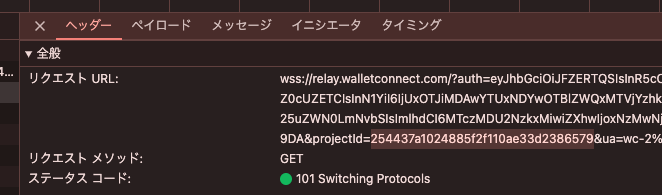

`debugger` をオフにしたいので、Anti-Anti-Debugger 拡張機能を入れて調査し始めた。
文字列が3文字ごとに分割されて検索しつつ`' + '`を取り除いたり、変数を評価して置き換えたりした。

気合で調べていると Drainer コントラクトのアドレスが見つかった:

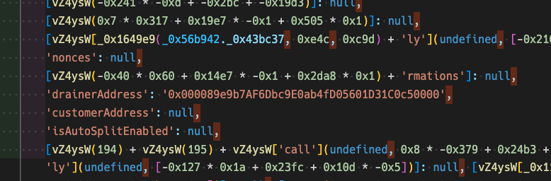


あと`debugger`の実行位置も見つけたので、適当な文字列（ここでは`ANTI`）を挿入して実行しないようにした:
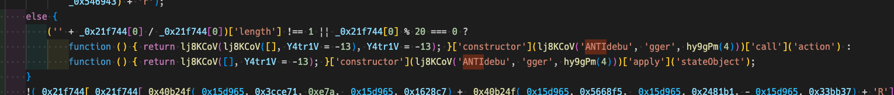

残るはセカンドレベルドメインだけど、`//`や`htt`みたいな文字列で検索して、それっぽいところを気合で難読化解除していくと序盤で見つかった:

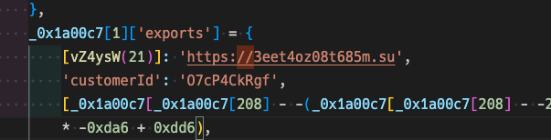

完全な挙動は理解していないが、これでフラグは構成可能。
ちなみに、このフィッシングツールは、Inferno Drainer という有名なフィッシングサービス。

Flag: `SCAN2024{0x000089e9b7AF6Dbc9E0ab4fD05601D31C0c50000:3eet4oz08t685m:254437a1024885f2f110ae33d2386579}`

## Drainer - 2

### Description
We discovered that the drainer is designed to interact with the drainer control API server to receive the contract address.

Additionally, it was identified that the victim submitted a transaction calling the `Claim` (`0x3158952e`) method of the drainer contract. Now, we need to analyze the drainer contract pinpointed during the analysis of Drainer-1.

---

In the `multicall` (`0xcaa5c23f`) method of the drainer contract, there is a check to verify if the caller is Inferno. Identify which address must be used to pass this check.

1. **inferno_approvals_address:** `^0x[a-fA-F0-9]{40}$`

---

Determine the method used to collect the stolen native assets from the drainer contract. Specifically, identify the asset transfer destination address and the method signature used to retrieve the address.

2. **native_dst_address:** `^0x[a-fA-F0-9]{40}$`
    
3. **method_signature:** `^0x[a-fA-F0-9]{8}$`


---

Identify the funder address of the drainer contract deployer.

4. **deployer_funder_address:** `^0x[a-fA-F0-9]{40}$`

---

**Flag Format (case-insensitive):** `SCAN2024{inferno_approvals_address,native_dst_address:method_signature,deployer_funder_address}`

(*The flag format does not include characters denoting strings such as ', " and similar.*)

### Solution

被害者のアドレスから [Drainer Contract](https://etherscan.io/address/0x000089e9b7AF6Dbc9E0ab4fD05601D31C0c50000) の `Claim` (`0x3158952e`) 関数を呼び出すトランザクションが送信されている。
4つほど答えるものがあるので、それを順番にやっていく。

まずは、`multicall` 関数で呼び出し元アドレスが特定のアドレスじゃないと動かないようになっているので、それを見つけなくてはならない。

適当に `multicall` を呼び出しているトランザクションを選び、トレースする:

```
$ cast run (pbpaste) --quick
Traces:
  [119470] 0x000089e9b7AF6Dbc9E0ab4fD05601D31C0c50000::multicall([(0x14C5a9007FDC5eE4De1581C892b5fd4623D8cdBf, 0xd505accf000000000000000000000000702fd7fb0d2d218b978acae7c0b644d831eb9969000000000000000000000000000089e9b7af6dbc9e0ab4fd05601d31c0c50000ffffffffffffffffffffffffffffffffffffffffffffffffffffffffffffffffffffffffffffffffffffffffffffffffffffffffffffffffffffffffffffffff000000000000000000000000000000000000000000000000000000000000001b344604f5983da8dfa95e66849e6dd8037eb1fa67cab37f6eed6f3edf133fd4e455ffb46d1f6f6a55f701c9872f76d29895a0280a41c3525b2efdfd0e7fec7b54), (0x14C5a9007FDC5eE4De1581C892b5fd4623D8cdBf, 0x23b872dd000000000000000000000000702fd7fb0d2d218b978acae7c0b644d831eb9969000000000000000000000000ff3a8d02109393726a90c04d7afd76e2d571890e00000000000000000000000000000000000000000000000002624713cb203cce)])
    ├─ [5523] 0x0000E23aBdC862a1911d77904e77Fdb378D00000::getOwners()
    │   └─ ← [Return] 0x000000000000000000000000000000000000000000000000000000000000002000000000000000000000000000000000000000000000000000000000000000010000000000000000000000000000db5c8b030ae20308ac975898e09741e70000
...
```

オーナーが `0000db5c8b030ae20308ac975898e09741e70000` だとわかり、これが答え。

次に、ネイティブアセットの送金先アドレスと、そのアドレスを取得するメソッドを見つけなくてはならない。

まずはバイトコードから関数セレクタを抜き出す（`erever disas -b (pbpaste) | grep PUSH4`してその結果を適当にChatGPTで抜き出すなど）:

```
0x715018a6,0xa457c2d7,0x18160ddd,0x70a08231,0x06fdde03,0x4e487b71,0xcaa5c23f,0xa9059cbb,0x39509351,0x095ea7b3,0xcce3d5d3,0x313ce567,0x23b872dd,0x95d89b41,0x8da5cb5b,0xf2fde38b,0xdd62ed3e
```

そして、[openchain.xyz](https://docs.openchain.xyz/#/default/get_signature_database_v1_lookup) のAPI使って関数シグネチャを調べる。
しかし、有用そうなものはなかった。

`multicall` をいくつか調べても特にわからなさそうだったので、ちょっと方針を変えようとしていると `Claim` で ETH が送金されていることに気づいた。
そこで適当な `Claim` トランザクションを選び、トレースする:

```
$ cast run (pbpaste) --quick
Traces:
  [17658] 0x000089e9b7AF6Dbc9E0ab4fD05601D31C0c50000::Claim{value: 41602000832346954}()
    ├─ [2577] 0x0000E23aBdC862a1911d77904e77Fdb378D00000::nativeCryptoReceiver()
    │   └─ ← [Return] 0x000000000000000000000000000037bb05b2cef17c6469f4bcdb198826ce0000
    ├─ [55] 0x000037bB05B2CeF17c6469f4BcDb198826Ce0000::fallback{value: 41602000832346954}()
    │   └─ ← [Stop] 
    └─ ← [Stop] 
```

ここで `nativeCryptoReceiver` 関数を呼び出していることがわかり、 `0x000037bb05b2cef17c6469f4bcdb198826ce0000:0x9b2d7f65` が答え。

最後に、Drainer Contract のデプロイヤーの資金提供アドレスを答えなくてはならない。

これは簡単で、コントラクトクリエイターのトランザクションみたら最初のトランザクションの送信元アドレスだった:
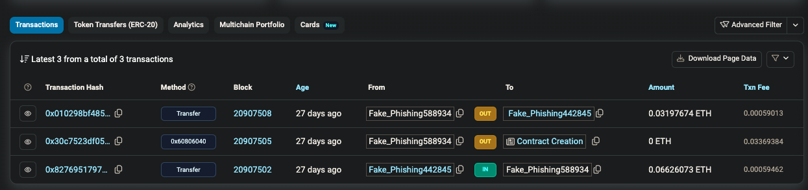

Flag: `SCAN2024{0000db5c8b030ae20308ac975898e09741e70000,0x000037bb05b2cef17c6469f4bcdb198826ce0000:0x9b2d7f65,0x717A486fecEBcC6bC48B9083c3441F4F71Ba0E69}`

## Drainer - 3

### Description
We discovered the attacker used Inferno Drainer, a phishing toolkit (SaaS). More detailed analysis was conducted to track the purchasers of the tool, and seemingly unusual patterns of on-chain activities related to the drainer contract were discovered.

In particular, after the victim approved their tokens to the phishing address, the `inferno_approvals_address` used the drainer contract's `multicall` method to distribute the victim's ERC20 assets to several designated addresses in specific proportions. During this process, assets were typically transferred to two EOAs per transaction. Analysis revealed that the first EOA was connected to the Inferno Drainer's author, while the remaining EOAs were possibly related to phishing toolkit operating groups.

Based on this pattern, similar transactions can be traced to identify the flow of assets more clearly between the phishing toolkit's users and the author.

**Note that the analysis should be based on the Time Frame of Incident specified in Drainer-1.**

---

Identify the EOA address of the Inferno Drainer author (the first EOA revealed by the analysis mentioned in the description).

1. **inferno_drainer_address:** `^0x[a-fA-F0-9]{40}$`

---

Based on the count of distinct stolen ERC20 assets in descending order, identify the EOA of the phishing toolkit operating group that stole the most ERC20 assets among them. (excluding the Inferno Drainer author's address)

2. **phishing_first_group_address:** `^0x[a-fA-F0-9]{40}$`

---

Identify the EOA addresses of the groups that received the same type (i.e., the same token contract address) of ERC20 assets as the identified `phishing_first_group_address`. Only include if the Inferno Drainer Author was paid a fee during the toolkit operating group's receipt of the assets. (exclude the Inferno Drainer author's address and `phishing_first_group_address`).

3. **phishing_sub_group_addresses:**

```python
",".join(sorted([phishing_sub_group_address_1, phishing_sub_group_address_2, phishing_sub_group_address_3, ...], key=lambda k: int(k, 16), reverse=True))
```

**phishing_sub_group_address_N:** `^0x[a-fA-F0-9]{40}$`

---

**Flag Format (case-insensitive):** `SCAN2024{inferno_drainer_address:phishing_first_group_address:[phishing_sub_group_addresses]}`

(*The flag format does not include characters denoting strings such as ', " and similar.*)

### Solution

まず以下のことが示唆されている:
- Inferno Drainer は `multicall` 関数を用いて被害者のERC20トークンを複数のアドレスに分配する。
- この分配プロセスは通常1つのトランザクションで2つのEOAに送金される。
- ここで、最初のアドレスは Inferno Drainer の作者に関連していると思われ、残りは Inferno Drainer のユーザーである。

つまり、Inferno Drainer はフィッシングのSaaSということ。

この問題も3つほど答えなくてはならないものがある:
- 最初に指定された Inferno Drainer の作者に関連していると思われるアドレス
- 指定された期間で、最も多くの種類の ERC-20 トークンを盗んだユーザー
- 指定された期間で、そのユーザーと同じ種類の ERC20 トークンを盗んだ全ユーザー

該当するトランザクションを抜き出して、アドレスと盗んだトークンを整理すれば自然とわかりそうだと思った。

まずは、Google Big Query を使って全て抜き出す:

```sql
SELECT
  transactions
FROM
  `bigquery-public-data.crypto_ethereum.transactions` AS transactions
WHERE
  transactions.from_address = '0x0000db5c8b030ae20308ac975898e09741e70000'
  AND transactions.to_address = '0x000089e9b7af6dbc9e0ab4fd05601d31c0c50000'
  AND transactions.block_timestamp BETWEEN TIMESTAMP('2024-10-06 15:48:11 UTC') AND TIMESTAMP('2024-10-08 07:36:59 UTC')
  AND transactions.receipt_status = 1
  AND SUBSTR(transactions.input, 1, 10) = '0xcaa5c23f'
ORDER BY
  transactions.block_timestamp,
  transactions.nonce
LIMIT 1000
```

そして、そのトランザクションを cast でトレースして `transfer` だけ抜き出し、良い感じに整形した:

```
0x280579955efe32f586360e75588a245764fbfe1d5f54bf474e4dc033e2e5a65a
    ├─ [229009] 0x8A458A9dc9048e005d22849F470891b840296619::transferFrom(0x5e95076CDC574Efaf3B41e6fe20c2AB79CC07266, 0xaA862F977d6916A1e89E856FC11Fd99a2F2fAbF8, 45792817631414994 [4.579e16])
    ├─ [85521] 0x8A458A9dc9048e005d22849F470891b840296619::transferFrom(0x5e95076CDC574Efaf3B41e6fe20c2AB79CC07266, 0x864eCC548dF6a49F4f69cd6106aDB7A6Dd80f765, 259492633244684969 [2.594e17])
--
0x8c14c0f672a26b61f19c77294a53dcff50aa7b7671911b6948ff7b62721cd02c
    ├─ [19730] 0x32bd822d615A3658A68b6fDD30c2fcb2C996D678::transfer(0xaA862F977d6916A1e89E856FC11Fd99a2F2fAbF8, 17154091149914450 [1.715e16])
    ├─ [25530] 0x32bd822d615A3658A68b6fDD30c2fcb2C996D678::transfer(0x864eCC548dF6a49F4f69cd6106aDB7A6Dd80f765, 97206516516181886 [9.72e16])
--
0x8ac6d8ef1da9196192e84ae76fa8cbc8402c11af7cef8ed1f7fb9954424808c4
    ├─ [27641] 0x7223442cad8e9cA474fC40109ab981608F8c4273::transferFrom(0xa73b4e9fdB35C2288f8aD5f031855c6f498C179A, 0xaA862F977d6916A1e89E856FC11Fd99a2F2fAbF8, 10778543743892940 [1.077e16])
    ├─ [12341] 0x7223442cad8e9cA474fC40109ab981608F8c4273::transferFrom(0xa73b4e9fdB35C2288f8aD5f031855c6f498C179A, 0x864eCC548dF6a49F4f69cd6106aDB7A6Dd80f765, 61078414548726662 [6.107e16])
--
...
```

この結果をパースして、フラグを構成した（スクリプトは解いた当時の汚いままで、整形時に不足した情報を少し加えたりしたことによるアドホックな処理がある）:

```python
import re
import web3

with open("trace.txt") as f:
    blocks = f.read().split("--")

    attacker_to_tokens = {}

    for block in blocks:
        lines = block.split("\n")
        for line in lines:
            # <address>::transfer(<address>
            m = re.search(r"(0x[a-fA-F0-9]{40})::transfer\((0x[a-fA-F0-9]{40})", line)
            if m is not None:
                m1 = web3.Web3.to_checksum_address(m.group(1))
                m2 = web3.Web3.to_checksum_address(m.group(2))
                print(m1, m2)
                attacker_to_tokens[m2] = attacker_to_tokens.get(m2, []) + [
                    web3.Web3.to_checksum_address(m1)
                ]
            m = re.search(
                r"(0x[a-fA-F0-9]{40})::transferFrom\(.+, (0x[a-fA-F0-9]{40})", line
            )
            if m is not None:
                m1 = web3.Web3.to_checksum_address(m.group(1))
                m2 = web3.Web3.to_checksum_address(m.group(2))
                print(m1, m2)
                attacker_to_tokens[m2] = attacker_to_tokens.get(m2, []) + [
                    web3.Web3.to_checksum_address(m1)
                ]
            if line.startswith("!"):
                m1, m2 = line[1:].split(",")
                m1 = web3.Web3.to_checksum_address(m1)
                m2 = web3.Web3.to_checksum_address(m2)
                print(m1, m2)
                attacker_to_tokens[m2] = attacker_to_tokens.get(m2, []) + [
                    web3.Web3.to_checksum_address(m1)
                ]

inferno_drainer = "0xaA862F977d6916A1e89E856FC11Fd99a2F2fAbF8"
first = "0x864eCC548dF6a49F4f69cd6106aDB7A6Dd80f765"
sub_groups = []

tmp = sorted(attacker_to_tokens.items(), key=lambda x: len(set(x[1])), reverse=True)
for attacker, tokens in tmp:
    print(attacker, len(set(tokens)))

for attacker, tokens in attacker_to_tokens.items():
    for token in tokens:
        if token in attacker_to_tokens[first]:
            print(attacker, len(set(tokens)))
            if attacker not in [inferno_drainer, first]:
                sub_groups.append(attacker)
            break

print(
    "SCAN2024{"
    + inferno_drainer
    + ":"
    + first
    + ":["
    + ",".join(sorted(sub_groups, key=lambda k: int(k, 16), reverse=True))
    + "]}"
)
```

Flag: `SCAN2024{0xaA862F977d6916A1e89E856FC11Fd99a2F2fAbF8:0x864eCC548dF6a49F4f69cd6106aDB7A6Dd80f765:[0xdB0f7D48794cd51A0c02A9602E3a23eDB66F8E26,0xd3B5f3E567F7Db51E16293A6de4457312E9E5c5d,0x60Bfbb7e79B1F7AF0Dc513E460dEFBE143A1bc21]}`

## Drainer - 4

### Description
Through the analysis in stages 1 to 3, we found the addresses of the Inferno Multichain Drainer [Reborn] group and the toolkit purchasers (phishing toolkit operating groups). We could utilize this information to investigate the off-chain communication methods between the toolkit buyers and the Inferno Group.

To officially prove the communication method, the authors of Inferno Drainer published a message containing the contact information signed by the `inferno_approvals_address`. Identify the corresponding Message and Signature Hash information.

---

**Flag Format (case-sensitive):** `SCAN2024{base64_encode(inferno_message),inferno_signature_hash}`

**inferno_message** is text

**inferno_signature_hash:** `^0x[a-f0-9]{130}$`

(*The flag format does not include characters denoting strings such as ', " and similar.*)

### Solution

フィッシングツールキットである Inferno Drainer の作者と購入者のオフチェーンの通信方法を特定せよ、という問題。

Telegram に何か鍵がないか色々調べたけど、結局 `inferno_approvals_address` による署名を Etherscan で検索すればよかった: https://etherscan.io/verifiedSignatures?q=0x0000db5c8b030ae20308ac975898e09741e70000

そして、 https://etherscan.io/verifySig/81591 が答え。

Flag: `SCAN2024{V2UgYXJlIG9mZmljaWFsbHkgYmFjayBhdCBodHRwczovL3QubWUvaW5mZXJub1JlYm9ybg==,0xfef96dfd14e87f0b4d2b0f19efc49b022a73a6004ae05ca9296c61fc3d1ffce20cb85b3b01b462a240f0a21f532e88b4ecfe003536222a2a059448584b8b1c381b}`

（競技中に新しい署名が公開されたのが謎 https://etherscan.io/verifySig/258733 ）

## CAT - 1

### Description

**Intro**

An anonymous ransomware group has developed the 'CAT' ransomware, a global threat infecting various devices worldwide. The scale of the damage is enormous, with data losses occurring globally.

Victims must transfer 10,500 satoshis of BSV to a specific broker address to recover files infected by the ransomware. The broker, after confirming the payment, deducts a fee and transfers the remainder to the master address. Once the master address verifies the payment, it generates a script using its ScriptPubKey. Then, when the victim satisfies the input conditions through ScriptSig, the recovery key generation is confirmed.

We must investigate the ransomware group by tracing detailed information about their operations, fund management, and script specifics. The goal is to analyze the recovery key generation algorithm so that victims can generate the recovery key without paying.

**Environment Information:**

- **Chain:** Bitcoin Satoshi Vision (Testnet, Node Version: Bitcoin SV:1.1.0)
- **Explorer:** [Whatsonchain Testnet Explorer](https://test.whatsonchain.com/)
- **Timeframe:** Wed Oct 15 ~ 17
- **Faucet:** [Witness on Chain Faucet](https://witnessonchain.com/v1/faucet/tbsv)
- **Asset:** BSV (Native)

**Tasks**

Based on the victim's address `mjhMMJ2Rhu9MDNVY9udxS9U9yK4KMWY1JA`, analyze the pattern of sending BSV to the broker to receive the CAT ransomware recovery key. Use this analysis to investigate the fund flow within the ransomware group.

1. **Identification of Victim Addresses:**
    
    **VICTIM_USERS_ADDR_N:** `^[mn][a-zA-Z0-9]{33}$`
    
    **VICTIM_USERS_ADDRS:** `",".join(sorted([VICTIM_USERS_ADDR_1, VICTIM_USERS_ADDR_2, VICTIM_USERS_ADDR_3, ...], reverse=True))`
    
    (*Sorted in descending order.)
    
2. **Identification of Broker Addresses of the Ransomware Group:**
    
    **BROKER_ADDR_N:** `^[mn][a-zA-Z0-9]{33}$`
    
    **BROKER_ADDRS:** `",".join(sorted([BROKER_ADDR_1, BROKER_ADDR_2, BROKER_ADDR_3, ...], reverse=True))`
    
    (*Sorted in descending order.)
    
3. **Identification of the Master Address of the Ransomware Group:**
    
    **MASTER_ADDR:** `^[mn][a-zA-Z0-9]{33}$`
    

---

**Flag Format (case-sensitive):** `scan2024{[VICTIM_USERS_ADDRS]:[BROKER_ADDRS]:MASTER_ADDR}`

(*The flag format does not include characters denoting strings such as ', " and similar.*)

### Solution

CATというランサムウェアの資金の流れを分析して、被害者、ブローカー、管理者（マスター）のアドレスを特定する問題。

CATランサムウェアは、被害者がファイルをリカバリーするために、Bitcoin Satoshi Vision (BSV) のテストネットで 10,500 satoshi をブローカーアドレスに要求する。
支払いが確認されると、ブローカーが手数料を差し引いて、マスターアドレスに送金する。
マスターアドレスが支払いを確認した後、 `ScriptPubKey` を使用してスクリプトを生成して、被害者が `ScriptSig` で条件を満たすとリカバリーキーが生成される。

まずは[被害者のアドレスが一つ与えられている](https://test.whatsonchain.com/address/mjhMMJ2Rhu9MDNVY9udxS9U9yK4KMWY1JA)ので、ここから調査していく:

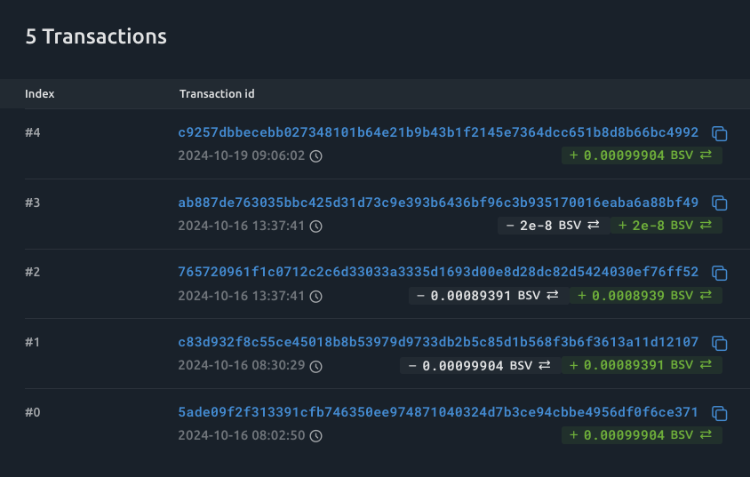

このうち最新のものは指定されたタイムフレーム`Wed Oct 15 ~ 17`の範囲外なので無視して良い。

10,500 satoshi は 0.00010500 BSV なので、#1のトランザクションがブローカーへの送金トランザクションだとわかる:

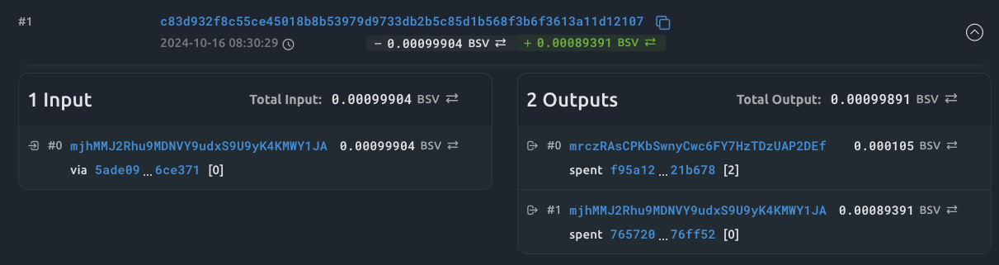

[ブローカーのアドレス](https://test.whatsonchain.com/address/mrczRAsCPKbSwnyCwc6FY7HzTDzUAP2DEf) は 103 件トランザクションがある。
とりあえず、マスターアドレスっぽいのは、 [0.0003 BSV を送金しているトランザクション](9fe5c06b6a3f16509f556a881d4db6f7bbe0454bfe2a8c88b49a1397dd05bbcd)の宛先アドレス [mhbqfwLN6Lw2dAjvsYCNcmc3HERbBx1eAW](https://test.whatsonchain.com/address/mhbqfwLN6Lw2dAjvsYCNcmc3HERbBx1eAW)。

そして、このマスターアドレス候補には 22 個のトランザクションがあり、 0.0003 BSV を送金しているブローカーと思われるアドレスを列挙:
- [mppJi8gGGjWEdzahhH3MdbBjNXEwE3hVxJ](https://test.whatsonchain.com/address/mppJi8gGGjWEdzahhH3MdbBjNXEwE3hVxJ)
- [mjfUXLaQgVYK4Meas1TnYbBZbNCFJmxqgC](https://test.whatsonchain.com/address/mjfUXLaQgVYK4Meas1TnYbBZbNCFJmxqgC)
- [mrczRAsCPKbSwnyCwc6FY7HzTDzUAP2DEf](https://test.whatsonchain.com/address/mrczRAsCPKbSwnyCwc6FY7HzTDzUAP2DEf)

あとは、ブロックエクスプローラーの API を使って 0.000105 BSV を送金した被害者アドレスを列挙して、フラグを構成するスクリプトを書いた:
```python
import requests

master_address = "mhbqfwLN6Lw2dAjvsYCNcmc3HERbBx1eAW"

broker_addresses = [
    "mppJi8gGGjWEdzahhH3MdbBjNXEwE3hVxJ",
    "mjfUXLaQgVYK4Meas1TnYbBZbNCFJmxqgC",
    "mrczRAsCPKbSwnyCwc6FY7HzTDzUAP2DEf",
]

victim_addresses = []

for broker_address in broker_addresses:
    url = f"https://api.whatsonchain.com/v1/bsv/test/address/{broker_address}/confirmed/history?limit=200"
    response = requests.get(url)
    assert response.status_code == 200
    data = response.json()

    txs = data["result"]
    print(len(txs))
    for tx in txs:
        print(tx)
        url = f"https://api.whatsonchain.com/v1/bsv/test/tx/hash/{tx["tx_hash"]}"
        response = requests.get(url)
        assert response.status_code == 200
        tx_data = response.json()
        vout = tx_data["vout"]
        for vout_x in vout:
            if not (
                vout_x["value"] == 0.000105
                and vout_x["scriptPubKey"]["addresses"][0] == broker_address
            ):
                continue
            url = f"https://api.whatsonchain.com/v1/bsv/test/tx/hash/{tx_data["vin"][0]["txid"]}"
            response = requests.get(url)
            assert response.status_code == 200
            prev_tx_data = response.json()
            prev_vout = prev_tx_data["vout"]
            victim_addresses.append(prev_vout[0]["scriptPubKey"]["addresses"][0])
            print(victim_addresses)

flag_broker = ",".join(sorted(broker_addresses, reverse=True))
flag_victim = ",".join(sorted(victim_addresses, reverse=True))

print(f"SCAN2024{{[{flag_victim}]:[{flag_broker}],{master_address}}}")
```

Flag: `SCAN2024{[n4r9C1oX6ovAknxBi46PDDE4gwpX7Yx3HR,n2UPxWYipDNSwr6FFRYLpAZQEYAWJbPM9X,n2FeVSexiK5UfnWn8H7zpMFfGyYx8onp9g,mzs2p7K9koSsCo1o7WkLzuiqSU9Q9adtVc,mwoqwSohmN8CYjnHgaVR6jkK4Gi6QvVgcy,mp6usjn35kzwLeuReRbWU1YXFzszp7hoRb,mofq86bHcKh3JN99V6oyC9yDhdzvCqCHaq,mmAJ5d35HYv6LLEFAacQ1wMcbeu3Uz9dTZ,mjhMMJ2Rhu9MDNVY9udxS9U9yK4KMWY1JA]:[mrczRAsCPKbSwnyCwc6FY7HzTDzUAP2DEf,mppJi8gGGjWEdzahhH3MdbBjNXEwE3hVxJ,mjfUXLaQgVYK4Meas1TnYbBZbNCFJmxqgC],mhbqfwLN6Lw2dAjvsYCNcmc3HERbBx1eAW}`

## CAT - 2

### Description

Based on the information identified in the CAT-1 challenge, interactions between the broker and the victim group have been confirmed. By analyzing the fund flow between the broker group and the victim group, you need to identify the script information generated by `MASTER_ADDR`. After the master address verifies the payment, it generates a script using its **ScriptPubKey**. Then, when the victim satisfies the input conditions through **ScriptSig**, please analyze the transaction where the recovery key generation is confirmed.

---

1. **Identification of the Script Public Key of `MASTER_ADDR`:**
    
    **MASTER_ADDR_SCRIPT_PUB_KEY:** `^[a-z0-9]{50}$`
    
2. **Identification of the script hash for the recovery key generation script related to the victim address `mjhMMJ2Rhu9MDNVY9udxS9U9yK4KMWY1JA`:**
    
    **MASTER_ADDR_SCRIPT_HASH:** `^[a-z0-9]{64}$`
    

---

**Flag Format (case-sensitive):** `SCAN2024{MASTER_ADDR_SCRIPT_PUB_KEY:MASTER_ADDR_SCRIPT_HASH}`

(*The flag format does not include characters denoting strings such as ', " and similar.*)

### Solution

マスターアドレスが支払いを検証した後に、ScriptPubKey を使用してスクリプトを生成し、被害者が ScriptSig を介して ScriptPubKey の条件を満たすトランザクションを生成する。
その ScriptPubKey を特定、および、与えられた被害者アドレスに関連するリカバリーキー生成を行うスクリプトのハッシュを特定せよ、という問題。

ScriptPubKey は、Bitcoin ベースのブロークチェーンにおいて、トランザクションの出力に設定されるもので、コインを受け取る側に条件づけを行う。
これによって、特定の条件を満たすことでしかコインを使えなくするようにできるもの。

マスターアドレスを見れば ScriptPubKey はわかる: `76a91416dccd9337f8540f8f28ca40269ec666d865324788ac`。

そして、[被害者のトランザクション](https://test.whatsonchain.com/address/mjhMMJ2Rhu9MDNVY9udxS9U9yK4KMWY1JA)を見てみると、[このトランザクション](https://test.whatsonchain.com/tx/ab887de763035bbc425d31d73c9e393b6436bf96c3b935170016eaba6a88bf49?tab=details) で ScriptHash をインプットに指定している。
そして、[その Script](https://test.whatsonchain.com/script/567268aa939500f24a5cee8f19db9a0e0ecb811bd32d06ade9e1605e1e5a5032) はマスターアドレスに生成されたものだともわかる。

Flag: `SCAN2024{76a91416dccd9337f8540f8f28ca40269ec666d865324788ac:567268aa939500f24a5cee8f19db9a0e0ecb811bd32d06ade9e1605e1e5a5032}`

## CAT - 3

### Description
Through the analysis of the CAT-1 and CAT-2 challenges, you have identified the script information that generates the ransomware recovery key. Now, you need to conduct an in-depth analysis of the script to understand the recovery key generation algorithm. To achieve this, you will analyze the script opcodes of the `scriptPubKey` and `scriptSig`.

The victim provided the necessary arguments in the correct order within the `scriptSig`. By doing so, they were able to unlock the script locked by the `scriptPubKey` of the UTXO at the master address, successfully generating the recovery key.

By analyzing the script's opcodes, you can identify a pattern where the values provided in the `scriptSig` are concatenated with specific values and then hashed. Your task is to conduct an in-depth analysis to extract the recovery key generation algorithm.

(The victim's address is `mjhMMJ2Rhu9MDNVY9udxS9U9yK4KMWY1JA`.)

---

1. **Identification of hexadecimal literal values used in the script to generate the recovery key:**
    
    Literals are in byte string format (e.g., `AAAA` is represented as `41414141`).
    
    **RECOVER_KEY_VALUES:** `",".join(sorted([hex_value_N, ...], reverse=True))` (*Sorted in descending order.)
    
2. **Identification of the generated recovery key:**
    
    **RECOVER_KEY:** `^[a-z0-9]{80}$`
    

---

**Flag Format (case-sensitive):** `SCAN2024{[RECOVER_KEY_VALUES]:RECOVER_KEY}` (*The flag format does not include characters denoting strings such as ', " and similar.*)

### Solution

リカバリーキーの生成アルゴリズムを解析する問題。
`ScriptPubKey`と`ScriptSig`をオペコードレベルで分析する必要がある。
具体的に答えなくてはいけないのは、リカバリーキーを生成するスクリプトで使用されている16進文字列の値の列と、生成されたリカバリーキーの特定。

とりあえずエクスプローラーで ScriptPubKey を取得する:
```
5343414e32303234 OP_FALSE OP_FALSE OP_FALSE OP_FALSE 4c495855534145434150 039a6cd58a84dfda002182d337751e6cbe38a714dffadd1b7bc37c58c82b973b1e 035c161281edc46c35c542c625314f69f7bda684440e345ce741afeac6b19f3ad7 OP_2 OP_PICK OP_7 OP_ROLL OP_DROP OP_6 OP_ROLL OP_6 OP_ROLL OP_6 OP_ROLL OP_6 OP_ROLL OP_6 OP_ROLL OP_6 OP_ROLL OP_OVER OP_6 OP_ROLL OP_DROP OP_2ROT OP_2ROT OP_5 OP_ROLL OP_DUP OP_5 OP_ROLL OP_DROP OP_4 OP_ROLL OP_4 OP_ROLL OP_4 OP_ROLL OP_4 OP_ROLL OP_FALSE OP_4 OP_ROLL OP_DROP OP_2SWAP OP_3 OP_ROLL OP_2DROP OP_DROP OP_7 OP_PICK OP_4 OP_PICK OP_EQUALVERIFY OP_6 OP_PICK OP_3 OP_PICK OP_EQUALVERIFY OP_5 OP_PICK OP_2 OP_PICK OP_EQUALVERIFY OP_7 OP_PICK OP_7 OP_PICK OP_7 OP_PICK OP_TRUE OP_4 OP_ROLL OP_DROP OP_2SWAP OP_3 OP_ROLL OP_3DUP OP_DROP OP_CAT OP_OVER OP_CAT OP_SHA256 OP_8 OP_PICK OP_CAT OP_NIP OP_NIP OP_2DROP OP_TOALTSTACK OP_2DROP OP_2DROP OP_2DROP OP_FROMALTSTACK OP_NIP
```

上記の16進数文字列をフラグに含めば良さそう。

そして、 ScriptSig は以下:
```
4c495855534145434150 039a6cd58a84dfda002182d337751e6cbe38a714dffadd1b7bc37c58c82b973b1e 035c161281edc46c35c542c625314f69f7bda684440e345ce741afeac6b19f3ad7
```

Bitcoin のスクリプトはまず ScriptSig が実行され、その後 ScriptPubKey が実行される。
なので、これらを結合して、 https://ide.bitauth.com/ でスタックを検証した。
`OP_EQUALVERIFY` の後にリカバリーキーが出力されるので、そこらへんにあると推測でき、`OP_SHA256` の値に `OP_CAT` で `SCAN2024` を付け足した値がリカバリーキーっぽい見た目をしており、これが答えと判断: `ee24ea0267c90806e0928d432e506ca7f10c5c40cac6c5c79c142d295eeca63d5343414e32303234`

Flag: `SCAN2024{[5343414e32303234,4c495855534145434150,039a6cd58a84dfda002182d337751e6cbe38a714dffadd1b7bc37c58c82b973b1e,035c161281edc46c35c542c625314f69f7bda684440e345ce741afeac6b19f3ad7]:ee24ea0267c90806e0928d432e506ca7f10c5c40cac6c5c79c142d295eeca63d5343414e32303234}`
